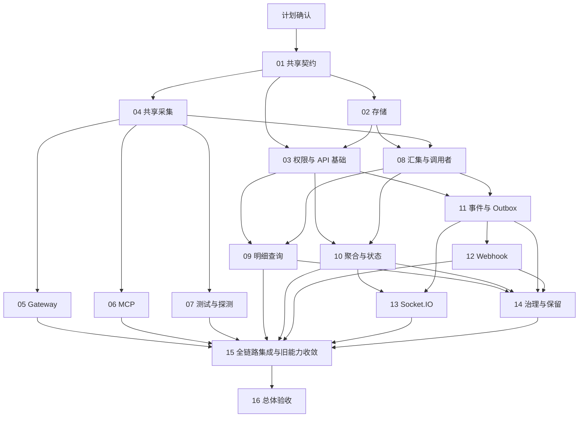

# 可观测性开发任务计划

> Document status: Maintained execution plan; approved, active execution
> Scope decision (2026-09-08, approved): 统一采用新格式、新 Endpoint 和新数据库初始化结构；移除旧格式导入、兼容查询和历史迁移链。任务编号不变，OBS-TP-15 改为全链路集成与旧能力收敛。
> 需求、设计与建议默认值已于 2026-09-08 获得用户同意。任务计划已获用户确认，按依赖持续编码和验证。
> 关联：[需求](./runtime-observability-requirements.md)、[设计](../reference/runtime-observability-design.md)、[对外 API](../reference/runtime-observability-api-endpoints.md)、[执行状态](./runtime-observability-development-execution-status.md)。

## 1. 交付边界与工作规则

交付完整的后端日志、审计、可观测性 API、主动推送与消息记录能力，覆盖 Gateway、MCP、上游 API 和测试/探测来源。复用既有认证、审计及实时通道。大屏 UI、多主机远程采集、外部消息总线、自动业务重放和第三方存证不纳入本轮。

本计划共有 16 个实现任务包。需求/设计确认和本轮文档作为两个独立文档任务登记，不混入代码完成率。已有安全任务台账仅用于协作背景，不导入其中的完成状态或测试数字作为本项目证据。

每个任务包都有进入条件、输出物、适用测试、文档责任和退出标准；只写代码不算完成。接口文档和任务台账在同一任务包中维护，不等最终联调再补写。

全局编码门禁为 OBS-GATE-01，已通过。OBS-TP-01/02/04 已满足各自退出条件；OBS-TP-03/05 继续实施，OBS-TP-06/07/08 已就绪。后续按依赖推进，不重复请求计划确认。

## 2. 任务包总表

表中依赖均为硬依赖，即前置任务满足其退出条件；测试夹具/接口草稿可提前准备，但不能据此把依赖视为已完成。规模 S/M/L 表示相对复杂度，不是天数或工期承诺。

| 任务包 | 内容与输出 | 硬依赖 | 规模 | 主要负责边界 |
| --- | --- | --- | --- | --- |
| OBS-TP-01 | 共享字段、错误/字节/计数契约、当前字段映射与接入覆盖清单 | OBS-GATE-01 | M | parser/audit 契约、API DTO 契约 |
| OBS-TP-02 | 数据实体、索引、初始化基线、事务仓储、正文对象、事件序号基础 | OBS-TP-01 | L | API database 与新调用观测存储模块 |
| OBS-TP-03 | 管理认证/资源范围、细分权限、API envelope/游标/版本并发基础 | OBS-TP-01、02 | M | security、monitoring 公共 API 层 |
| OBS-TP-04 | 共享调用上下文、阶段写入、受限正文与上游尝试采集器 | OBS-TP-01 | L | parser/audit、共享出站采集适配 |
| OBS-TP-05 | Gateway 入口及转发/拒绝/缓存/取消完整接入 | OBS-TP-04 | L | gateway-runtime |
| OBS-TP-06 | MCP 协议/Tool/上游关联和传输结束接入 | OBS-TP-04 | L | api-nova-server 与 parser transformer |
| OBS-TP-07 | Endpoint 测试、探测、验证与内部上游调用接入 | OBS-TP-04 | M | endpoint-testing、runtime-verification |
| OBS-TP-08 | 增量汇集、幂等、调用投影、调用者/来源归并与恢复 | OBS-TP-02、04 | L | 新收集器与调用者仓储 |
| OBS-TP-09 | 调用列表/正文/trace/callers/sources API 与读取审计 | OBS-TP-03、08 | L | monitoring 查询服务与 DTO |
| OBS-TP-10 | 聚合/去重/直方图、总览/依赖/状态、能力 API | OBS-TP-03、08 | L | runtime-observability 聚合与状态 |
| OBS-TP-11 | 规范持久事件、事务 Outbox 分发、事件历史/游标 API | OBS-TP-03、08 | L | event repository、dispatcher |
| OBS-TP-12 | Webhook 订阅、签名、投递、重试/死信与管理 API | OBS-TP-11 | L | subscription/delivery worker |
| OBS-TP-13 | 现有 Socket.IO 统一事件接入、快照衔接、补拉与慢消费 | OBS-TP-10、11 | M | websocket gateway |
| OBS-TP-14 | 保留/配额/策略 API、采集健康、清理与故障降级闭环 | OBS-TP-09、10、11、12 | L | policy/retention/pipeline |
| OBS-TP-15 | Gateway/MCP 与全部查询报送集成、旧能力收敛、切换/回退 | OBS-TP-05、06、07、09、10、12、13、14 | M | 跨模块集成 |
| OBS-TP-16 | AC-01~20 总体验收、平台/数据库矩阵、性能与对外文档收口 | OBS-TP-15 | L | 集成验证与交付证据 |

## 3. 依赖图与执行顺序

结构性主链是 01 → (02 与 04 汇合) → 08 → 11 → 12 → 14 → 15 → 16。权限路径 02 → 03 会同时约束查询、聚合和事件；10 → 13 是大屏实时能力的另一条必经分支。实际工期关键路径需要在各包实施后依据复杂度和验证结果调整。

| 波次 | 可执行任务 | 波次退出产物 |
| --- | --- | --- |
| W0 | 文档、OBS-GATE-01 | 需求/设计已确认；本计划与接口细化获确认 |
| W1 | OBS-TP-01 | 冻结共享契约、映射与数据源权威 |
| W2 | OBS-TP-02 与 04 可并行 | 存储事务基础和共享采集器 |
| W3 | OBS-TP-03、05、06、07、08 可并行 | 权限基础、三类实际采集、增量入库 |
| W4 | OBS-TP-09、10、11 可并行 | 明细与分析 API、统一事件历史 |
| W5 | OBS-TP-12 与 13 可并行 | 主动 Webhook 与可靠实时恢复 |
| W6 | OBS-TP-14 | 配额/保留、策略与运行健康闭环 |
| W7 | OBS-TP-15 | 全链路可用与旧能力收敛 |
| W8 | OBS-TP-16 | 验收证据、可用范围与集成文档 |

波次是推荐协作顺序，不引入额外等待：某任务硬依赖已完成即可启动。未修改同一文件且契约稳定时可并行；共享 schema、数据库初始化基线、module 注册和生成文档由单一任务包统筹，避免并行覆盖。

## 4. 任务包执行卡

### OBS-TP-01 共享契约与接入映射

输入为已确认需求/设计、现有 Gateway DB/JSONL/MCP 记录和安全契约。输出共享 schema、四种 spanKind、内部 ID/父子链路、origin、outcome、字节/错误枚举、当前字段映射及“每个实际请求仅一个上游节点”的覆盖清单。

明确当前 schema 的真实 eventId/invocationId 来源、旧 Gateway 双写关系、HTTP 字节测量阶段、管理 prefix 和现有 Socket.IO 连接契约。冻结 afterSequence 启动与签名 after 游标恢复的区别、If-Match/Idempotency-Key 细则，并同步对外文档。

退出：有正常/拒绝/缓存/重试/Tool 错误的契约夹具及身份/计数断言，无法补全的旧字段有明确 legacy/unknown 规则。不能用时间接近猜测调用同一性。

### OBS-TP-02 存储、事务与序号基础

输出 invocation/payload/caller/source/observation/checkpoint/receipt、事件/订阅/投递/聚合逻辑表的基础实体和新版初始化脚本，建立受控正文对象存储、关键索引与短事务仓储。

本包提供调用更新+事件插入+receipt+checkpoint 的同事务 API、单调提交事件 sequence 分配器和查询水位基础。TP-08 使用该事务能力，TP-11 只扩充分发，不再重建另一条非事务事件路径。

既有安全数据库基线重整与本项目分开协作。本任务不得擅自清空已有数据；直接维护当前实体与 SQLite/PostgreSQL 初始化基线，在隔离空库中验证；不开发旧版本数据库升级链。

退出：SQLite/PostgreSQL 的约束/索引与数据保留结构通过针对性验证；重复唯一键、事务回滚、并发提交序号、文件路径约束与孤立对象回收有证据。

验收边界：本包验证存储原语和数据库方言；Linux、完整系统事务并发及跨包 AC-20 仍由 TP-15/16 负责，不把 Windows 组件测试外推为完整平台验收。TP-14 接入 GC 调度和策略，本包不自动开启清理。

### OBS-TP-03 权限与 API 基础

输出细分权限、服务身份资源范围、共享 guard、响应 DTO、错误码、受控查询参数、签名游标和 If-Match/幂等基础。正文权限必须按 AND 组合。

退出：元数据/正文/IP/订阅/重投权限和跨资源访问有允许与拒绝测试；伪造游标、跨过滤复用、版本冲突、无 Token 不能绕过。此包不以尚未开放的业务 Endpoint 假装全部 API 完成。

### OBS-TP-04 共享采集器

输出 begin/progress/finish、异步上下文、原始字节测量、递归脱敏、受限正文暂存、元数据队列与写失败健康计数。实际 HTTP 尝试适配器统一表示重试/重定向，不再次实现业务重试。

按进程追加输出当前 v2 schema；默认 16 MiB/最大 64 MiB、采集内存预算和省略原因可配置。最低限度容量保护在这里落地，不能等 TP-14 再补。

退出：并发链路不串线，正常空正文/省略/中断可区分，秘密不进入文件或 stdout；存储失败不改变业务响应或重发上游。

### OBS-TP-05 Gateway 接入

覆盖入口、路由未匹配、认证/权限/限流、缓存、实际转发、客户端取消和流结束。入口 body/Response 与出站 body/Response 分侧记录，内部 requestId 一次生成并传播。

退出：AC-01/03/04/08 的 Gateway 部分通过；正常响应只终结一次，缓存不产生上游节点，被替换的旧元数据路径不再生成重复事实。新增修改集中在 gateway-runtime。

### OBS-TP-06 MCP 接入

在当前版本协议与传输行为上接入 mcp_protocol、mcp_tool、upstream_api；认证前拒绝不猜工具参数，Tool isError/JSON-RPC 错误独立于 HTTP 状态。

处理 stdio、SSE/streamable、会话/取消/长流和 parser transformer 的实际出站尝试，携带受管资产快照。与 TP-04 的公共 HTTP hook 保持单点计数。

退出：AC-02/03/04/05/08 的 MCP 部分与 STDIO 输出约束通过；重试/重定向完整、无协议版本升级或认证降级。

### OBS-TP-07 测试、探测与内部调用接入

输出 Endpoint 测试、探测、运行验证的上游日志，标 origin=test/probe/internal。无外部请求时根节点为真实内部调用，不生成虚构 Gateway/MCP 访问。

退出：AC-18 通过；默认 external 统计不含测试/探测或 telemetry，所有实际依赖请求能按资产/实例查询。代码证据列出具体接入路径，不以目录级声明代替覆盖。

### OBS-TP-08 汇集、身份与恢复

输出增量文件收集、完整行检查、schema 校验、事务幂等、started/finish/修正投影、来源冲突隔离、caller/source 增量归并和数据集初始化。

只接受当前 schema，以 eventId/源进程序号用于去重；检查点与调用/事件同事务。可信 issuer/sub 或 subject 延续已有 callerId；IP/匿名/失败来源分离且限制高基数。早期 pipeline 状态、水位和缺口计数必须随收集实现。

退出：AC-06/07/09/10 的核心路径通过；重启/半行/重复导入不会重复计数；推断 unknown 可被真实终态修正。数据集初始化默认不推送旧业务事件。

### OBS-TP-09 明细与审计 API

交付 OBS-API-03~10。提供元数据、分侧正文、trace、调用者/来源和标签修改，执行统一授权及敏感读取审计，返回明确正文状态和旧数据覆盖范围。

退出：参数/分页/响应/错误/权限与 Endpoint 文档及 Swagger 对齐；AC-17 和正文过期查询可验证。没有授权的 trace 节点不暴露内容或隐含数量。

### OBS-TP-10 聚合、状态与能力 API

交付 OBS-API-01/02/11~15。实现 timeBasis/scope、去重人数、字节覆盖、直方图、调用者历史桶、迟到修正、依赖影响与 heartbeat/freshness。

使用 TP-02 的事件仓储发布 bucket/state 变更，不依赖 TP-11 Webhook 分发完成即可验证；这是避免聚合和事件互相等待的接口边界。

退出：AC-11/19 及典型小样本人工可推导指标通过；无流量/缺口/失联分开，分位为近似且范围可解释；capabilities 精确说明可用维度和历史限制。

### OBS-TP-11 持久事件与 Outbox

交付 OBS-API-16。规范已入库事件的对外信封、sequence、订阅配置生效点、租约/分发水位、过滤授权、事件游标与补拉。

调用完成、修正、状态和聚合更新共用事件写入基础。过滤后空批次可推进游标，权限/过滤变更和过期有明确错误。

退出：事务提交/回滚、重复分发、晚到更正、恢复水位、游标越界和有界读取测试通过；不在业务请求线程同步发送网络消息。

### OBS-TP-12 Webhook 与投递管理

交付 OBS-API-17~25 与 OBS-PUSH-02。实现订阅修订/启停、secretRef/HMAC、出站地址约束、超时、六次有限重试、租约恢复、死信、幂等人工重投和尝试查询。

退出：AC-12/13/17 通过；2xx 确认丢失可重复但 eventId 不变；订阅地址/权限变更明确作用于任务；日志投递不再触发无限业务审计循环。文档包含实际请求 Header 和接收端验签夹具。

### OBS-TP-13 Socket.IO 与快照恢复

交付 OBS-PUSH-01。沿用既有 namespace/连接方式，新订阅使用同一持久事件源，支持 from snapshotSeq、签名游标、有限补拉/缓冲、慢客户端断开和 Token 过期。

退出：AC-14/17 通过；补拉与实时切换无时间缝隙；重复/晚到桶按版本替换，不能按收到消息次数累加。同步更新已有 runtime-event 消费者，不新增旧消息适配层，不把敏感事件无条件全局广播。

### OBS-TP-14 保留、容量与运行健康

交付 OBS-API-26~28。统一暴露前面任务已有的采集/聚合/投递指标，实现有效策略、TTL、磁盘配额、正文过期状态、receipt 墓碑、孤立对象和未导入暂存处理。

清理不能复活已过期调用、绕过正文 TTL 或删除尚被有效投递引用的事件。配额降级和已知缺口必须可见，未知丢失量不能伪装精确值。

退出：AC-15/16 完成，回收/重启/数据库失败的降级不破坏业务路径；策略变更版本和管理审计可查。

### OBS-TP-15 全链路集成与旧能力收敛

依次联通“真实外部请求 → 上游 → 文件 → 索引 → 查询/聚合 → 事件 → 接收端”，覆盖三类采集来源与两类服务器。将重复 gateway-access-logs/external-callers 查询及其现有调用方收敛到新 Endpoint，验证统一分页、字段和权限；不保留兼容别名。

输出增量启用、有限数据集初始化、停止新消费者的回退步骤；不能靠删数据回退。关联 ID 与数据源权威要证明没有两路日志重复计数。

退出：每条完整链路有可定位的证据与接入切换用例；API 文档填入已验证的实际 prefix、Socket.IO 连接参数和测试版本。

### OBS-TP-16 总体验收与交付证据

组织 AC-01~20 回归、Windows/Linux 与 SQLite/PostgreSQL 矩阵、参考负载测试和大正文/长流边界评估。每个任务包此前已经执行适用测试，本包负责跨包整体验收而非首次测试。

记录机器/数据库/负载/持续时间/正文策略、附加耗时、入库/推送延迟、查询性能与资源容量。未具备某个平台或外部接收环境时明确 BLOCKED/未验证范围，不能伪造通过。

退出：所有必需证据通过，接口文档、Swagger、运行配置、验收记录与状态台账一致。实现完成不等于已发布，不自动部署、发布或更改已有版本。

## 5. 需求与验收追踪

| 需求 | 主责任任务包 | 主要验收 |
| --- | --- | --- |
| FR-01 上游调用 | 04、05、06、07 | AC-01/02/04/18 |
| FR-02 外部访问 | 05、06 | AC-01/03/05 |
| FR-03 调用者/来源 | 01、08、09 | AC-06/07 |
| FR-04 正文/字节 | 04、05、06、09、14 | AC-08/16 |
| FR-05 明细/复盘 | 08、09 | AC-09/10/17 |
| FR-06 聚合 | 10 | AC-11 |
| FR-07 推送/记录 | 11、12、13 | AC-12/13/14 |
| FR-08 状态/大屏数据 | 10、13、14 | AC-19 |
| FR-09 权限/自身审计 | 03、09、11、12、13 | AC-17 |
| FR-10 保留/可靠性 | 02、04、08、14 | AC-09/10/15/16 |
| 跨平台/数据库 | 02、15、16 | AC-20 |

表中简写数字均指 OBS-TP-XX。AC-01~20 的需求定义仍以需求文档为准，不在计划中改写预期结果。

## 6. 状态、完成标准与证据

执行状态唯一台账为配套 execution-status 文档。任务状态使用 BACKLOG、READY、IN_PROGRESS、BLOCKED、REVIEW、DONE、DEFERRED，与现有项目习惯一致。全局审批门禁单独记录，不把“等待计划确认”误报为实现技术故障。

任务 DONE 必须同时具备：已交付的代码/配置/初始化基线或该包明确的文档产物；对应验收结果；适用测试记录；更新的 API/设计与破坏性调整说明；没有会破坏依赖方契约的未决问题。仅计划、写入代码、运行过但失败的测试不能满足 DONE。

每次更新填写实际受影响文件、完成项、测试命令/结果、证据路径、数据库影响、待办与下一步。未执行测试写“未执行”，日期不代表测试通过。回归导致契约失效时任务重开，不保留虚假的 DONE。

API 状态依其自己的契约测试推进，不由某个共享基础包 DONE 自动把全部 Endpoint 标为可用。没有发布验证只到 VERIFIED，AVAILABLE 需要明确部署版本和范围。

## 7. 风险、协作与调整规则

| 依赖/风险 | 处理原则 |
| --- | --- |
| 多层调用被误作同一计数边界 | TP-01 固定显式 spanKind；旧格式不导入，新数据不猜测归并 |
| 现有安全/数据库工作同时修改共享文件 | 按文件归属协调、保留既有改动；不重置或清空 |
| shared HTTP hook 重复包裹 | TP-04 统一边界，05/06/07 接入测试证明次数 |
| SQLite 写入竞争与大正文 | 短事务、单写入者、正文分离、明确容量；性能由证据限定 |
| 消息成功但 ACK/事务丢失 | 至少一次、eventId 去重、租约恢复、保留尝试 |
| 全部持久化路径不可用 | 独立健康/进程 stderr 报告；不承诺此时仍可靠推送 |
| 未具备 PostgreSQL/Linux 或外部接收环境 | 台账登记具体受阻验收，继续无依赖工作，不伪造完成 |
| 契约实施发现必要调整 | 非破坏性澄清同步文档；改变已确认产品边界时明确记录并请求一次决策 |

正文默认保留 7 天并不保证任意负载的磁盘都足够。沿用已确认容量与降级约定，实际部署需匹配负载。

## 8. 本次确认与启动动作

16 个任务包、依赖/完成标准和 API Endpoint 细化已获确认，OBS-GATE-01=PASSED。按依赖逐包开发、验证并维护对外文档与状态台账；用户补充的全新版本范围已同步纳入。

常规依赖推进、测试与文档维护已属于后续编码授权范围，不逐包重复请求批准。发布、部署或扩大范围不包含在这次计划确认中。

## 当前实施补充

OBS-TP-02 已完成存储包退出条件：20 个存储实体、调用版本、正文对象、去重凭据、冲突隔离、断点与同事务事件基础，以及两个数据库的空库初始化文件；本轮补充正文归属、写入/回收租约、generation 隔离与有界 GC。新模块尚未接入应用入口；不能据此认为自动采集或查询 API 已经上线。

OBS-TP-04 的单次物理上游请求适配器和 16 项故障/边界测试已补齐，四组 parser 测试共 60 项通过，parser/API 构建均通过，按共享采集器退出条件收口为 DONE。实际服务器接入仍归 TP-05/06/07，完整平台矩阵仍归 TP-16。实际完成情况以[执行台账](./runtime-observability-development-execution-status.md)为准。

验证执行更新（2026-09-08）：API build、48 项存储/GC 用例及 PostgreSQL 四进程提交/回滚/回收竞争均已通过。此前两方言隔离烟测均为 63 表、schemaDrift=0；本轮 PostgreSQL 仍为零漂移，脚本清理退出码为 0。按原包级退出标准，TP-02=DONE、TP-03=READY，TP-08 仍等待 TP-04。Linux/完整矩阵留在 TP-16，全系统 SQL.js 并发和非致命 pg 弃用警告留在 TP-15；28 个 HTTP Endpoint 与两类推送仍为 PLANNED。

## TP-03 本轮进度

2026-09-08：按用户指示将此前所有改动提交为 efb4536 后，进入 TP-03。实现受管管理 Token 用途隔离、四个细分权限、角色级显式资源范围、AND guard、响应/错误 DTO、受限参数、签名游标和同事务 If-Match/幂等原语。角色范围复用现有受权限保护的角色管理接口，不使用可自改用户资料，不新增授权数据库表。

本轮 API 构建通过，新增 56 项专项测试，但测试模块缺少 Guard 的 JwtService 等依赖，在初始化时失败，业务断言未执行。原有 48 项存储/GC 用例通过，不能代替 TP-03 专项验收。TP-03 仍为 IN_PROGRESS，修复确认待答复；查询与推送依赖不提前释放。

## TP-04 收口和下一轮接入

2026-09-08：共享上游适配器已完成并通过 16 项新增用例，连同原有 44 项共 60 项 PASS；parser/API 构建通过。只观察实际流字节，不重试、不二次消费流，日志失败保持业务返回值或原异常。TP-04=DONE，TP-05 开始接入分析，TP-06/07/08=READY。

TP-05 优先建立 Gateway 入口到实际上游尝试的父子关系，替换代理层的手动重复采集，修正 auditRecorded 导致入口证据缺失的路径；随后覆盖拒绝/未匹配/缓存/取消/重试及客户端发送终态。当前只完成接入点定位，不能标为已接入或已验证。

用户已明确授权后续同类构建、专项测试与阶段提交直接执行；持续按任务依赖推进，不新增部署、远端推送或业务库清理授权。
