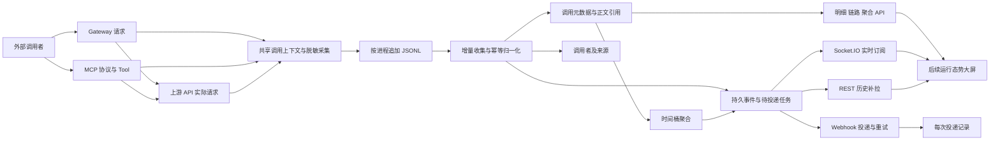

# 统一调用日志、审计与可观测性设计

> Document status: Approved design baseline; implementation in progress; endpoint integration pending
> Scope decision (2026-09-08, approved): 用户明确允许统一修改旧接口和数据库结构。新采集仅输出 schemaVersion=2，新查询不导入旧格式、不保留旧接口兼容别名；数据库维护新的初始化基线，不设计旧库升级链。实际旧数据不自动删除。
> 配套需求：[功能需求文档](../guides/runtime-observability-requirements.md)。
> 方案及建议默认值已于 2026-09-08 由用户确认，当前按开发计划实施；实际变更和验收证据以执行状态台账为准，未部署或处理业务库。
> 实施配套：[对外 API Endpoint](./runtime-observability-api-endpoints.md)、[开发任务计划](../guides/runtime-observability-development-task-plan.md)、[执行状态](../guides/runtime-observability-development-execution-status.md)。

## 1. 设计决策

采用“共享采集契约 + 本地追加日志 + 增量数据库索引 + 持久事件投递”的方案。已有审计文件作为采集入口和恢复证据；数据库提供可查询调用事实、身份与聚合，事件表提供报送事实，投递表记录发送过程。

API 管理面集中提供 Gateway 和 MCP 的查询及推送服务。每条记录保留 serverType、runtimeAssetId 及进程实例标识，使上层能按两类服务器管理，无需每个 MCP 子进程另建管理 API。

首期以现有 TypeORM 数据库为基础，兼容 SQLite/PostgreSQL，不强制新增中间件。使用已有 /monitoring Socket.IO/WebSocket 通道，并补充通用 HTTPS Webhook。REST 历史补拉覆盖可靠恢复；暂不另起 SSE 推送通道。

既有普通日志、管理操作审计、运行状态与调用证据职责保留，通过 ID 关联，不能把普通控制台日志解析为主要调用事实。

## 2. 现有接入点与证据边界

以下路径相对于仓库根目录，来源于前轮源码核查和本轮补充核查。

| 接入点 | 已有基础与拟变更 |
| --- | --- |
| packages/api-nova-api/src/modules/gateway-runtime/gateway-runtime.controller.ts | Gateway 入口，建立一次内部调用上下文，覆盖返回与拒绝分支 |
| packages/api-nova-api/src/modules/gateway-runtime/services/gateway-runtime.service.ts | 转发、策略、缓存与结果处理；分离入口与实际出站证据 |
| packages/api-nova-api/src/modules/gateway-runtime/services/gateway-access-log.service.ts | 在接入与集成包中移除重复调用日志写入/查询，收敛到单一调用事实 |
| packages/api-nova-parser/src/audit/runtime-call-audit.ts | 复用 begin/finish、正文脱敏与 JSONL，扩展阶段记录及可恢复采集 |
| packages/api-nova-parser/src/transformer/index.ts | MCP 上游请求执行接入位置；编码时确认每个实际尝试与重定向边界 |
| packages/api-nova-server/src/tools/runtime-security.ts | 可信身份与认证失败上下文 |
| packages/api-nova-server/src/transportUtils/audit.ts | MCP 协议、工具调用审计关联 |
| packages/api-nova-server/src/transportUtils/stream.ts、sse.ts | 会话、长流、终止与传输状态 |
| packages/api-nova-api/src/modules/servers/services/server-metrics.service.ts | 已有工具观测摘要；统一后由规范事实产生相应结果事件，避免双计 |
| packages/api-nova-api/src/modules/runtime-observability | 已有事件、状态与指标；补充事件游标和采集/依赖状态 |
| packages/api-nova-api/src/modules/monitoring | 沿用现有管理入口，新增明确 DTO 与路由 |
| packages/api-nova-api/src/modules/websocket/websocket.gateway.ts | 已有 runtime-overview、runtime-event、runtime-log 等实时路径；新增统一持久事件订阅 |
| packages/api-nova-api/src/modules/endpoint-testing、runtime-verification | 统一接入上游跟踪，分别标记测试/探测来源 |

当前共享审计契约已经描述 Gateway/MCP 实际正文记录、调用者观察、默认 16 MiB 上限以及写入失败放行。本设计在该基础上补齐查询与报送，不把旧文档“改造前缺口”重复列为当前缺陷。

本轮确认存在实时发送路径，但没有完成对所有通知渠道实现的穷举验证。因此，现有实时通知不能直接被认定为已经满足本文的持久投递、去重、游标和恢复契约；这些应按验收场景明确补齐。

## 3. 总体数据流



MCP 子进程持有不可变的调用上下文并写入本进程文件；管理 API 只增量读取，不在每次查询时扫描全部 JSONL。STDIO 只输出协议数据，采集与控制信息走文件、管理器或现有受控进程通道。

持久化调用状态变更、调用者关联、规范事件和收集检查点在同一数据库事务中提交。聚合异步消费规范变更，记录自己的水位。首次写入正文对象发生在事务之前，事务失败留下的孤立对象由清理任务回收。

## 4. 调用模型与关联规则

### 4.1 调用类型

| spanKind | 边界 | 主要计数 |
| --- | --- | --- |
| gateway_request | 一次外部 Gateway HTTP 请求，含缓存、未匹配与拒绝 | businessRequests、httpIngressRequests |
| mcp_protocol | 一次 MCP 协议请求或 HTTP 连接操作，含认证前拒绝 | protocolRequests；HTTP 传输时计 httpIngressRequests |
| mcp_tool | 一次已识别 tools/call，包括工具参数验证失败 | businessRequests、toolCalls |
| upstream_api | 一次实际出站 HTTP 请求，包括重试、重定向每跳 | upstreamRequests |
 
MCP HTTP envelope 与工具是不同边界：先有 protocol，再有 tool，再有 upstream；STDIO 同样可建立协议父节点，但不产生 HTTP 流量。一次 SSE 长连接不是它传输的每个工具调用。批量协议请求若当前传输支持，则每个逻辑操作独立建子节点；不在本次改造中新增协议支持。

Gateway 缓存命中没有 upstream 节点。上游测试/探测可成为 origin=test/probe 的根节点，不创建虚构外部访问。后台任务可使用 origin=internal，默认业务看板只取 external。

### 4.2 关联标识

- invocationId：在调用开始时生成，单次调用内不变；作为数据库唯一调用标识。
- traceId、parentInvocationId：串联一条因果链；异步上下文显式传播，不能仅按相邻时间猜测。
- rootInvocationId：索引根节点；父节点晚到允许暂时缺失。
- requestId：内部请求关联 ID；clientRequestId、clientCorrelationId 单独保存并限长。
- protocolRequestId、sessionIdHash：协议内关联；不得用作认证身份或全局唯一主键。
- upstreamOperationId、attemptIndex、redirectHopIndex：区分逻辑依赖、重试轮次和每次网络跳转。
- sourceInstanceId、processInstanceId、sourceSequence、sourceEventId：识别生产进程及原始记录，用于幂等和缺口检查。
- recordVersion、schemaVersion：调用投影修订版本与采集格式版本。

不直接信任客户端 traceparent 或自报 ID 作为内部主键。需要保留时记为外部关联字段；上游凭证仍由现有实例配置注入，不通过可观测性改造转发入站凭证。

runtimeAssetId 是两类服务器的统一业务身份。serverId 可保留 MCP 的历史服务标识；Gateway 不需要伪造 MCP serverId。调用保存 runtimeAssetEndpointBindingId、endpointDefinitionId、sourceServiceAssetId、sourceServiceInstanceId、operationId、toolName 和发布/路由快照。

独立 Server 缺少受管资产 ID 时保留实际 operationId/method/path，并标识 unmanaged；运行实例注册不能根据外部提交的字符串直接绑定到受管资产。

### 4.3 调用状态与错误

生命周期为 started、running、completed；outcome 为 success、error、rejected、timeout、cancelled、incomplete、unknown。HTTP status、protocolErrorCode、toolIsError、errorCategory 和 failureStage 分别保存，不能互相替代。

outcome 是本调用边界的结果：工具成功不抹掉失败的上游尝试；上游 HTTP 成功不等于工具成功；客户端响应中断也可能发生在上游已经成功之后。业务 JSON 中的“错误码”只有配置了 API 结果判定规则时才参与业务失败分类，不能任意猜测。

begin 阶段写 started；finish 写真实终态。长流可按不短于 15 秒的间隔写进度与观察字节，事件限频。进程失联且无终态时，收集器生成 outcome=unknown、completionSource=reconciled 的不完整投影，不伪造 timeout 或成功。

真实终态晚到时覆盖推断投影、增加 recordVersion，并生成 invocation.reconciled；聚合按修订撤回旧贡献再计入新贡献。已经推送的历史事件保留，新事件显式关联 replacesEventId。需要区分真实中断 incomplete 与缺少证据 unknown。

## 5. 存储模型

逻辑表名为设计命名；实现时遵循现有实体与空库初始化基线，不增加历史升级迁移。

| 表/对象 | 核心内容与约束 |
| --- | --- |
| runtime_invocations | 调用标识、类型、身份、资产快照、时间、结果、字节、正文引用、recordVersion；invocationId 唯一 |
| runtime_payload_objects | 请求/响应分侧内容、状态、策略版本、摘要、大小、对象定位和过期时间 |
| runtime_callers | 稳定可信主体、显示备注、first/lastSeen、状态；沿用已有 callerId |
| runtime_caller_credentials | callerId 与凭证记录/subject 的关系，不含原始 Key、JWT 或授权头 |
| runtime_access_sources | 匿名/认证失败来源、可信 IP 观察与来源类别；限制高基数 |
| runtime_caller_observations | 调用者、来源、服务器和协议关系；first/lastSeen、活动时间桶 |
| runtime_ingest_checkpoints | 文件身份、已提交字节位置、进程序号和最近成功/失败；按完整记录提交 |
| runtime_ingest_receipts | 当前 v2 的 sourceInstanceId/sourceEventId 唯一身份；防重与冲突隔离 |
| runtime_metric_buckets | 可合并计数、字节和固定耗时直方图；bucketVersion 与水位 |
| runtime_caller_buckets | callerId/服务器/时间活动及计数；支持去重活跃人数与调用者历史 |
| runtime_observability_events | 复用现有事件，扩展规范信封、持久 sequence、主体/资源及调用关联 |
| runtime_event_subscriptions | 目的地址、过滤、权限范围、配置修订、生效 sequence、密钥引用 |
| runtime_event_deliveries | subscriptionId/eventId 唯一，状态、租约、下次重试、次数、配置修订 |
| runtime_event_delivery_attempts | deliveryId/attemptNo 唯一，每次发送及响应摘要 |
| runtime_pipeline_state | 收集/聚合/投递水位、积压、失败计数、容量与最新自检时间 |

调用详情索引至少包括 (startedAt, invocationId)、(runtimeAssetId, startedAt)、(callerId, startedAt)、(endpointDefinitionId, startedAt)、(spanKind, outcome, startedAt)、traceId、parentInvocationId 和 upstreamOperationId。按实际查询选择组合索引，避免给大正文或不受控 URL 建全文索引。

正文使用受控文件对象目录，数据库只存定位和脱敏元数据；与元数据分开过期。以 invocationId/side/version 分配对象，不对不同调用的敏感正文做跨主体去重。先写临时文件再原子改名，路径由服务生成；不能把数据库中的任意路径当作可读取文件。

SQLite 首期使用单收集/聚合写入者、短批次事务与现有方言工具；PostgreSQL 可扩展多 worker 租约。事件顺序和幂等依赖唯一约束及事务，不依赖某一种数据库的 JSON 查询扩展。

## 6. 采集、归一化与故障恢复

### 6.1 全新开发版本契约

采集层固定 schemaVersion=2，显式记录 spanKind、phase、recordVersion、eventId、processId/sourceSequence、内部因果 ID 和字节计量方式。仅接受当前格式，不推断旧 Gateway DB 与 JSONL 之间的对应关系，也不从上游日志补造外部入口。

begin、progress、finish 是同一 invocationId 的不同版本；每次写入使用独立 eventId。收集器消费专用 v2 文件，未知 schema 隔离并报告格式错误。无历史自动导入，不维护 legacy 查询路径。

共享字段、规范化与统计参考实现收敛在 parser/audit/runtime-observability-contract.ts；API 负责存储、查询和报送，parser 不依赖 NestJS 或数据库。实际核查与验证见 [契约接入映射](./runtime-observability-contract-mapping.md)。

### 6.2 增量导入

每个进程只追加自身文件，使用启动 UUID 而不是可复用 PID 作为稳定身份。管理进程以有限批次读取完整记录并提交收集检查点。文件末尾不完整行等待后续数据，关闭后仍不完整则隔离并记录缺口。

v2 正文采用有界采集/暂存，收集按正文上限和 Base64 膨胀设置明确行上限。超出支持上限的记录隔离，不尝试无界读入。

同一次导入事务写入去重 receipt、调用新版本、身份关系、终态/更正事件和检查点；事务失败从旧位置重试。若相同 ID 出现不同已完成内容，隔离为冲突，不覆盖证据。

重命名、轮转和文件截断分别识别。检查点不能只使用路径，旧文件在已确认导入且过了恢复保留期后才删除。重复扫描、重复进程通知、数据库重启不能造成调用或聚合重复。

### 6.3 可靠性与降级

正常关闭排空已提交的采集队列；进程强杀前仍在内存中的数据不保证留存。可选更强刷盘策略需要单独性能评估，首期不宣称每次业务返回前已 fsync。

采集内存预算建议 128 MiB、只排队有界元数据/正文对象引用。大正文使用背压或受限暂存，不能同时给每个并发请求预留 16 MiB。预算不足时优先保留元数据，正文标记 omitted/capture_budget；若连元数据也无法保留，则增加 droppedRecords/knownGaps 并通过独立 stderr/运行健康路径报告。

数据库不可用时使用本地暂存；恢复后从检查点继续。暂存满、权限失效或过期清理时，不能静默删除未导入数据。确需容量降级时生成带来源/时间范围的缺口记录，并在恢复后补报。无法知道丢失数量时返回 unknown，不能编造精确计数。

采集、聚合与报送各有心跳。整个持久层不可用时事件推送本身也可能不可用，运维必须能够从独立健康探针或进程 stderr 得知异常。

## 7. 身份与 IP 观察

已验证 JWT 沿用现有 issuer + NUL + sub 的稳定 callerId 规则，不重新编码全部历史身份。API Key 优先使用受信任 subject，credentialId 为可轮换的关联标识。旧 Gateway 凭证级主体需显式映射才能跨 Key 归并。

记录 authState、identitySource、callerId、credentialId、sourceId、peerIp、clientIp、ipSource、proxyTrusted。可信代理解析由共享规则实现，从直接连接端逐跳验证，不能只读取客户端提供的第一个 X-Forwarded-For 值。

匿名观察按授权资源范围与来源特征生成带版本的 HMAC 标识，可按天聚合；密钥轮换通过 keyVersion 区分，不能保证匿名主体跨天或跨代理地址稳定。不把匿名来源数展示为人数。

认证成功后先记录可信 caller，再决定该工具/路由权限。认证失败仅进入来源观察，避免把伪造 JWT sub 或 API Key 当成真实主体。来源实体按作用域限制高基数，超限汇入 unclassified/overflow 桶并返回降级数量。

调用者计数通过规范入库事实维护。不导入旧 external-callers 文件。新调用者清单从 v2 入库事实生成，historyCompleteSince 表示当前数据集有效起点。

## 8. 正文、字节与留存

### 8.1 正文状态

每一侧至少提供 state、reason、contentType、encoding、observedBytes、capturedBytes、storedBytes、redacted、redactionPolicyVersion、capturedDigest 和 digestScope。

state 为 captured、omitted、incomplete、expired、unavailable；正常空正文为 captured 且 observedBytes=0。reason 区分 not_read、size_limit、invalid_json、unsupported_multipart、stream_interrupted、policy、capture_budget、storage_failure 和 legacy_missing。

capturedDigest 沿用既有原始观察字节摘要时须标识 digestScope=observed_raw；额外的 storedDigest 用于验证脱敏后保存内容。部分流摘要标记 partial。默认不在推送或聚合中暴露摘要，避免低熵敏感值被枚举。

既有正文策略继续生效；不能因日志上限降低而改变业务 HTTP 接收限制。MCP 已有入站大小限制属于独立传输策略，日志遗漏不能额外改变正常业务响应。

### 8.2 流量口径

- HTTP 调用在各自应用边界测量请求/响应 body 字节，在脱敏、截断和 Base64 前计量。
- byteMeasurement=observed_body、serialized_payload 或 unavailable；measurementStage 说明是在内容解码前、后或未知。
- MCP 工具参数/结果的 UTF-8 序列化字节为逻辑 Payload 大小，不等同于它的 HTTP/SSE 网络流量。
- httpIngressBytes 只汇总 Gateway 入口和 MCP HTTP 协议边界；upstreamBytes 只汇总实际 HTTP 出站，二者分别显示。
- 缺失或中断字节返回 null 或已知下界，并提供 measuredRecords、unmeasuredRecords、partialRecords；不能拿采集上限充当传输总量。
- 默认不计 HTTP Header、TCP、TLS 开销；计量方式变化需提升 schema/measurementVersion。

### 8.3 生命周期和容量

元数据/正文/事件/投递/聚合分别设 TTL。建议值见需求；正文先到期后仍可查询调用详情及 expired 状态。原始 JSONL 含正文，不能因为称为“恢复日志”而无限保留：已导入默认 48 小时清理，未导入最长受正文 TTL 和磁盘配额约束，达到约束时显式报缺口。

receipt 去重记录至少保留到所有可能被重新导入的源文件退出保留期，避免明细删除后旧文件再次导入。已退役文件身份保留轻量墓碑，阻止把过期数据复活；人工历史回填必须使用隔离任务并明确不参与实时推送。

容量按实际负载估算，不能用默认天数承诺固定磁盘足够。近似原始正文容量为 requestsPerSecond × averageBodyBytes × 86400 × retentionDays，另加 Base64/结构化开销、元数据、索引、暂存和备份。100 请求/秒、请求响应合计 8 KiB，原始正文约 65.9 GiB/天，7 天约 461 GiB，必须通过容量规划或显式采集策略匹配部署。

清理操作保留运行审计和删除水位。备份与归档的正文 TTL 由部署策略覆盖；不能声称删除在线文件等于已经删除所有备份。

## 9. 统计模型与口径

### 9.1 指标定义

| 指标 | 定义 |
| --- | --- |
| businessRequests | gateway_request + mcp_tool；不加 mcp_protocol 或 upstream_api |
| httpIngressRequests | HTTP Gateway + MCP HTTP 协议入口；STDIO 排除 |
| upstreamRequests | 实际 upstream_api 节点数，含每次重定向跳转 |
| retryAttempts | 去重后的 (upstreamOperationId, attemptIndex > 1) 数；不因重定向重复增加 |
| totalStarted | 按 startedAt 落桶的调用数，含尚未完成 |
| knownCompleted | success + error + rejected + timeout + cancelled + incomplete |
| failures | error + timeout + incomplete；unknown 单独列示 |
| successRate | success / knownCompleted；无分母时 null |
| errorRate | failures / (success + failures)；拒绝/取消另报，不混入该技术失败率 |
| uniqueCallers | 范围内不同可信 callerId 数；跨桶、跨服务器做集合去重 |
| anonymousSources | 范围内观察来源数量，与 uniqueCallers 分列 |
| requestBytes/responseBytes | 所选同一种边界/计量类型的已知观察量，附缺失与下界信息 |
| inFlight | 最近有效进程状态下尚未完成调用数；失联进程另列 unknownInFlight |
| p50/p95/p99 | 固定延迟直方图估计，返回 algorithm 和误差区间，不平均已有 p95 |

日志和统计默认 timeBasis=startedAt；需要完成吞吐时显式使用 completedAt，响应回显。过滤一个 start 时间区间可能包含仍在运行的请求，不能拿 totalStarted 直接作为完成成功率的分母。

同一调用的终态或更正更新它所属的时间桶。默认 origin=external。无流量返回零计数、null 比率，同时返回采集状态以区分“观察到零”和“未观察到数据”。

### 9.2 聚合与保留

明细期内支持精确条件过滤与去重。分钟聚合保存计数、和、最大值、字节与固定直方图；调用者桶保存实际 callerId/服务器活动，跨时间桶去重时取并集或查询 DISTINCT，不能相加。

建议直方图边界为 1、5、10、25、50、100、250、500、1000、2500、5000、10000、30000、60000 ms 及溢出桶。分位数返回所在区间及估计上界；落入溢出桶时返回下界，不伪造有限精确值。

长期聚合保留“时间+服务器+API/Tool”和“时间+调用者+服务器”两类必要粒度，避免生成全部维度笛卡尔积。超过明细保留期的“调用者+API+上游实例”任意交叉查询不保证支持，返回 422 UNSUPPORTED_HISTORICAL_DIMENSION，capabilities 明确可用组合。

聚合作业保存 consumptionWatermark，按 invocationId/recordVersion 幂等应用贡献变化，包含晚到和推断修正。bucketVersion 单调增长，推送完整桶替换值或失效通知，消费者不依据重复事件做盲目加法。

大屏查询返回 dataWatermark、aggregationLagMs、historyCompleteSince、isPartial 和 gapRanges。老记录缺失字节、历史导入未完成等都参与完整性计算。详细 API 可返回 observed/estimated 字节分组，不把不同测量阶段静默合并。

## 10. 对外 API 契约

以下均为拟新增接口。完整公共前缀采用现有 /api/v1/monitoring；文档中旧 /v1 写法属于控制器/反向代理前缀层级差异，编码时以实际全局 prefix 和 Swagger 为准，不能发布两个含义不同的基地址。

新接口公共路径为 /api/v1/monitoring/observability。沿用 management JWT 与明确权限，服务身份使用同一受管认证通道。业务 Gateway/MCP 凭证不能访问这些管理数据。

### 10.1 路由

| 方法与相对路径 | 用途 | 特殊参数/说明 |
| --- | --- | --- |
| GET /capabilities | schema、支持维度/组合、保留窗口、计量口径与限制 | 返回按权限裁剪后的能力 |
| GET /overview | 总览与初始化快照 | 含 snapshotSeq、各区块数据水位 |
| GET /invocations | 元数据列表 | 时间、callerId/sourceId、serverType/runtimeAssetId、spanKind、API/Tool、结果等 |
| GET /invocations/:id | 调用详情 | 含正文状态与链接、关联事件 ID |
| GET /invocations/:id/payloads/:side | 请求或响应正文 | side=request/response；单独正文权限 |
| GET /traces/:traceId | 父子调用与时间线 | 标记缺失/隐藏节点、调用链完整度 |
| GET /callers | 可信调用者清单与范围统计 | 搜索、认证类型、服务器、时间 |
| GET /callers/:id | 调用者详情 | first/lastSeen、凭证引用和访问摘要 |
| PATCH /callers/:id | 备注、标签 | 不修改历史认证事实；主体映射另走受控配置 |
| GET /sources | 匿名/失败来源与关联 IP 观察 | IP 字段另需权限，支持认证状态过滤 |
| GET /statistics/summary | 当前过滤范围汇总 | 必须声明 scope 与 timeBasis |
| GET /statistics/time-series | 时间桶序列 | interval、fill、scope |
| GET /statistics/groups | 分组排行 | groupBy、orderBy、top，最多两个维度 |
| GET /dependencies | 上游依赖与影响汇总 | endpoint/上游实例、请求与失败、关联外部调用数 |
| GET /servers/status | 服务器、依赖、采集状态 | 含心跳、新鲜度、版本 |
| GET /events | 持久事件历史/补拉 | after、until、类型/严重级别/服务器过滤 |
| POST /subscriptions | 创建 Webhook 订阅 | 目的地址、过滤、密钥引用、生效范围 |
| GET /subscriptions | 查询订阅 | 配置脱敏 |
| GET /subscriptions/:id | 订阅详情与健康 | 不返回签名秘密 |
| PATCH /subscriptions/:id | 更新过滤、地址、启停 | 乐观版本控制，新事件生效 |
| DELETE /subscriptions/:id | 软删除并停止新投递 | 保留历史 |
| POST /subscriptions/:id/test | 发送一条明确 test 事件 | 写投递记录，不计外部业务访问 |
| GET /deliveries | 逻辑投递列表 | subscriptionId、eventId、状态和时间 |
| GET /deliveries/:id | 投递及所有尝试 | 受限响应摘要 |
| POST /deliveries/:id/retry | 人工重投 | 同一 eventId，新尝试，支持 Idempotency-Key |
| GET /pipeline/status | 采集/聚合/报送健康 | 积压、水位、容量、错误与缺口 |
| GET /policies | 有效采集、保留和容量策略 | 按作用域返回配置版本 |
| PATCH /policies/:id | 修改策略 | 明确权限、审计、配置修订 |

首次订阅默认从创建时的已提交事件水位之后开始；不自动把历史正文或全部调用推向新地址。需要历史回放时使用受控事件查询，批量历史重投不在首期；单条已存在投递可 retry。

按新 Endpoint 文档统一查询入口。/management/gateway-access-logs、/management/external-callers 等重复调用日志路径在集成包中收敛，不保留兼容别名；更新现有调用方，维持必要的管理生命周期功能。

### 10.2 查询规范与响应

统一过滤参数：from、to、timeBasis、origin、serverType、runtimeAssetId、callerId、sourceId、endpointDefinitionId、toolName、sourceServiceInstanceId、spanKind、outcome、errorCategory、traceId、requestId、cursor、limit。不适用的参数返回 400，不静默忽略。

列表 limit 默认 50、最大 200，按 (startedAt DESC, invocationId DESC) 稳定翻页。查询游标包含过滤摘要、授权范围、快照水位与最后位置，由服务签名；跨过滤或权限范围复用返回 400/403。

统计默认最近 1 小时，最多 1440 个桶，top 最大 100。长时间范围须选择相应粗粒度；服务不默默截断时间区间。时间边界为 UTC [from,to)，固定时长桶按 UTC 对齐；展示时区由前端转换。自然日时区聚合如后续引入需新增显式契约，不能用 UTC 日桶伪装当地日桶。

scope 必选 business、http_ingress、tool、protocol 或 upstream，防止默认把所有节点加总。origin 默认 external。groups 最多两个维度，超出可用历史粒度返回可解释错误。正文接口受大小、读取频率和资源权限限制。

响应示意：
```json
{
  "status": "success",
  "data": {
    "items": [
      {
        "invocationId": "inv-1",
        "traceId": "trace-1",
        "spanKind": "mcp_tool",
        "serverType": "mcp",
        "runtimeAssetId": "runtime-1",
        "callerId": "caller-1",
        "toolName": "get_order",
        "outcome": "error",
        "httpStatus": 200,
        "toolIsError": true,
        "durationMs": 320,
        "payloadState": { "request": "captured", "response": "captured" }
      }
    ],
    "nextCursor": null
  },
  "meta": {
    "schemaVersion": "1.0",
    "snapshotSeq": "1842",
    "dataWatermark": "1839",
    "timeBasis": "startedAt",
    "origin": "external",
    "isPartial": false,
    "historyCompleteSince": "2026-09-08T00:00:00Z"
  }
}
```

isPartial 表示覆盖缺口/不完整，不等于水位存在几秒正常延迟；另返回 lagMs。计数/累计字节超出安全整数范围时使用十进制字符串，event sequence 始终用字符串。示例 ID 为说明性占位。

错误包括 400 INVALID_QUERY、401、403、404、410 PAYLOAD_EXPIRED/EVENT_CURSOR_EXPIRED、413 QUERY_TOO_LARGE、422 UNSUPPORTED_HISTORICAL_DIMENSION、429 和 503 OBSERVABILITY_UNAVAILABLE。已知但未采集正文返回 200 的 state/reason；整个调用不可见时不通过错误内容泄露其存在。

## 11. 持久事件与主动推送

### 11.1 事件信封与类型

事件结构复用 runtime_observability_events 的 family、severity、状态、资源与时间概念，增加下述对外稳定信封，不直接输出数据库实体：

```json
{
  "schemaVersion": "1.0",
  "eventId": "event-1",
  "sequence": "1843",
  "eventType": "invocation.completed",
  "occurredAt": "2026-09-08T10:00:01.000Z",
  "recordedAt": "2026-09-08T10:00:01.150Z",
  "server": { "type": "gateway", "runtimeAssetId": "runtime-2" },
  "subject": { "kind": "invocation", "id": "inv-2", "version": 2 },
  "traceId": "trace-2",
  "severity": "error",
  "data": {
    "spanKind": "gateway_request",
    "outcome": "timeout",
    "durationMs": 3000,
    "callerId": "caller-2",
    "endpointDefinitionId": "endpoint-2"
  },
  "links": { "invocation": "/api/v1/monitoring/observability/invocations/inv-2" }
}
```

建议首期事件：invocation.completed、invocation.reconciled、caller.discovered、server.state_changed、server.snapshot、metrics.bucket_updated、pipeline.state_changed。失败通过 invocation.completed 的 outcome/severity 过滤，不再为同一次失败额外生成一个必需的 invocation.failed 计数事件。上游失败使用 spanKind=upstream_api。

started/progress 主要更新查询状态和当前指标，不默认逐条对外推送；后续可按负载开放。控制面发布/生命周期等既有事件继续保留，并映射到相同外部信封。

业务事件发生时间 occurredAt 与管理面入库 recordedAt 分开。sequence 是部署内提交顺序，不代表跨进程实际发生顺序；因果分析仍依赖 trace/parent。

### 11.2 顺序、Outbox 与去重

由数据库事务内的串行序号分配器产生 sequence，保证对外可见序号按提交推进。PostgreSQL 仅用自增 ID 或调用前分配序号不能作为这个保证；实现需持有短事务计数行锁，SQLite 使用同一单写入事务。回滚不产生可见事件。

事件写入即进入 durable outbox。分发器为符合生效 sequence 和配置修订的订阅创建 delivery，并以 (subscriptionId,eventId) 唯一键去重；任务创建和分发水位同事务提交。过滤与授权作用于事件所属资源，不以客户端 room 名替代授权。

订阅创建/修改记录 effectiveFromSeq 和 revision。旧事件按当时配置选路，旧配置作为脱敏审计快照保留；暂停时停止派发和重试，恢复后继续已有积压，新事件是否积压固定为“暂停期间不创建”，返回 pausedGapRange。禁止在暂停恢复后悄悄补发暂停期全部事件。

修改地址或秘密时，未发送任务使用已绑定的配置修订；撤销某修订应将其待投递标为 cancelled，重新授权后可显式 retry。每次发送还检查订阅所有者当前资源权限与授权有效期。

### 11.3 Webhook 发送

POST JSON 单事件；Header 含 X-ApiNova-Event-Id、X-ApiNova-Delivery-Id、X-ApiNova-Timestamp、X-ApiNova-Signature。签名为 HMAC-SHA256(timestamp + "." + 原始发送 body)，使用专用订阅 secretRef，不复用业务 API Key。密钥支持版本轮换，绝不在读接口返回原文。

接收端验证签名和时间窗口，按 eventId 幂等处理；重复尝试使用相同 eventId 和新的发送 timestamp。deliveryId 表示逻辑投递，attemptNo 区分尝试。接收端 2xx 视为接收成功，包括 202；不能由此推断已完成后续处理。

默认总请求超时 10 秒，首次立即尝试，失败后按 5 秒、30 秒、2 分钟、10 分钟、30 分钟重试并加入抖动，共最多 6 次；最长保留活动重试 24 小时。网络错误、408、429、5xx 可重试；Retry-After 在上限内尊重，超过活动窗口进入 dead。其他 4xx 记为永久失败；3xx 不自动跟随。

worker 领取有到期时间的租约；进程中断后可重新领取。发送成功但确认事务未提交可能再次发送，这是至少一次语义。人工 retry 保留 eventId 与历史 attempts，增加 replayGeneration 并生成管理审计；事件已过期不可重投，返回 410。

目的地址默认 HTTPS，按部署出站策略与可配置允许列表约束；内网接收端需显式允许网段/域名。每次实际发送验证解析后的地址，防止 DNS 变化绕过限制，默认不跟随重定向，不访问云元数据地址。测试环境 HTTP 是显式配置，不能自动从请求参数放开。

响应正文只保留受限、脱敏的诊断摘要，建议上限 2 KiB；错误 URL 不含秘密。投递客户端标记 origin=telemetry 并排除业务调用采集。delivery 失败改变 pipeline 健康，不向同一个失败订阅递归发送其自身每一次失败事件。

### 11.4 WebSocket 与历史恢复

保留 namespace=/monitoring，新增 subscribe-observability，参数为过滤条件、after 和订阅版本；服务器鉴权后返回 subscription-confirmed 与范围。事件名统一为 observability-event，载荷是相同持久信封。

握手、订阅、历史补拉和持续连接都验证授权；凭证过期或权限撤销时停止发送并断开/要求重认证。不能把历史 runtime-event 的广播路径直接复用于带调用者或访问详情的敏感事件。

GET /events 以 sequence 升序补拉。响应 nextCursor 为本批已扫描位置，可能前进而 items 为空，因为过滤后无可见事件；游标同时绑定权限和过滤版本。事件过期时返回 410、earliestAvailableCursor 和需要重新获取快照的提示，不能静默跳过缺失区间。

快照读取使用一致的数据库视图返回 snapshotSeq；客户端先取 overview，再从该游标开始订阅。服务先固定高水位 H，补发 (after,H]，再发送 H 之后的实时事件；期间用有界缓冲或持久重读避免“补拉与订阅之间”的竞态。

聚合可能晚于 snapshotSeq，快照逐块返回 dataWatermark；聚合追上时产生 bucket_updated。前端按桶/状态版本替换或触发重查，不拿调用完成消息直接叠加到统计快照。

慢消费者达到缓冲上限时关闭连接并给出最后已发送游标，消费者使用自己最后已处理游标补拉。WebSocket 的已发送不代表浏览器已处理，不宣称为每个连接提供持久 ACK。需要审计可恢复投递的系统使用 Webhook 加 delivery API。

### 11.5 服务器状态与心跳

复用已有生命周期/健康模型，并增加 freshnessStatus、lastHeartbeatAt、processInstanceId、dataWatermark、activeInvocations 和 dependencyHealth。业务失败率、进程状态和采集健康分别输出。

默认每 15 秒汇报一次状态快照，无业务调用也发送。45 秒无心跳先标 stale/unknown；只有受管进程明确退出或探测确认时标 offline。单次上游失败产生调用事件，按配置窗口/阈值再影响 dependencyHealth，不能直接把整台 Gateway 标离线。

## 12. 权限与管理审计

拟复用 monitoring:read、monitoring:manage，并新增细分授权：monitoring:payload:read、monitoring:source:read、monitoring:subscription:manage、monitoring:delivery:retry。新权限名称是待实现契约，需同步权限种子、服务身份和 Swagger。

正文读取必须同时满足 monitoring:read、monitoring:payload:read 和目标资源权限；源 IP 类似。无论现有多权限装饰器采用 ANY 还是 ALL，都必须用明确 guard/策略实现上述 AND 语义，不能依赖未验证装饰器行为。

聚合与详情执行同一授权过滤。跨资源 trace 只返回可访问节点及通用不完整标记，不泄露隐藏节点的 URL、主体、数量或错误内容。请求游标、筛选列表和 capabilities 同样按权限裁剪。

服务端推送到经授权配置的 Webhook 地址，本质上授予该接收端订阅范围内元数据读取权；创建时校验拥有者权限，每次投递再次检查。默认不允许订阅正文或原始 IP。

对正文读取、策略/映射/订阅变更、测试推送和人工 retry 写管理审计；不对每次统计刷新再制造同等规模的业务调用事件。既有管理审计如有更长保留要求，沿用更严格配置。

## 13. 新版本结构与实施分解

| 步骤 | 交付 | 关键依赖/验收 |
| --- | --- | --- |
| A | 共享 schema、上下文、边界捕获、身份/来源映射 | FR-01~04；先证明单次调用与重试不会双计 |
| B | 新实体、增量收集、新格式校验、正文对象和恢复 | FR-03/04/10；重复导入、半行、磁盘/数据库故障 |
| C | 明细、正文、trace、callers/sources、权限 | FR-05/09；跨资源保护、历史可解释 |
| D | 聚合、capabilities、状态与 pipeline API | FR-06/08；计数与字节口径、迟到更正 |
| E | 持久事件、Webhook、投递恢复、Socket.IO 补拉 | FR-07；重复、断线、游标过期、重启 |
| F | 接口收敛、文档与计划中的场景/负载验证 | AC-01~20；SQLite/PostgreSQL 与两平台 |

数据库按当前实体维护 SQLite/PostgreSQL 初始化基线，仅在隔离空库中验证。用户允许结构调整，不表示授权清空现有开发数据；需要重建实际数据库时明确列出目标及数据影响。新版本不维护旧数据升级链或自动历史回填。

集成时直接收敛旧日志 Endpoint 和内部调用方，不建立双套查询真相。关闭新采集/报送 worker 不应自动删除调用证据。代码、测试与文档按任务计划持续推进，大屏 UI、多主机远程采集和外部消息总线仍为后续阶段。

## 14. 已确认决策

以下默认边界已由用户确认：同机多进程汇集；保留完整脱敏正文及既有 16 MiB 上限；按 30 天元数据/7 天正文等建议 TTL 治理；Webhook 至少一次投递加现有 Socket.IO 补拉；业务不中断、采集损失必须显式可观测。

实施阶段需要测量的技术项包括具体采集分支覆盖、旧记录关联字段、字节测量阶段、数据库容量与性能。这些属于确认后的工程验证工作，不把尚未验证的性能或覆盖范围写成已实现保证。

## 15. 存储基础实施记录

2026-09-08 已写入当前存储实体、事务仓储、正文对象存储，以及两种数据库的初始基线。调用当前投影与版本历史分开，sequence 使用事务内计数器，既有事件表复用 eventName/details，不再增加第二张同义事件表。非法/冲突证据仅保存哈希及安全原因，不复制正文。

具体结构、默认保留及未完成项见[存储基础实现说明](./runtime-observability-storage-foundation.md)。代码写入不代表初始化或验收通过；本轮没有执行数据库脚本，没有清空已有数据。自动汇集、接口权限、查询与分发仍按后续任务接入。

## TP-03 公共安全与 API 原语补充

TP-03 在提交 efb4536 之后实施；2026-09-09 夹具修复后 56 项专项与 48 项回归共 104/104 PASS，API 构建通过。新增四项细分权限进入现有 SYSTEM_PERMISSIONS；现有管理访问 Token 签发增加 management_access 用途及固定管理 audience/issuer，专用 Guard 校验这些声明和当前数据库账号，不接受业务 Token、刷新 Token 或客户端自报权限。

资源授权复用受控角色 metadata.observabilityScope，支持 all 或 assets/runtimeAssetIds。普通角色缺省不授权，系统 super_admin 保持全局范围；同一权限的范围取并集，各必需权限之间取交集。角色服务校验范围结构，创建和修改沿用管理审计。用户资料不作为授权源，禁用项和未支持的非空权限条件不放行。不新增授权表，也不扩大已有普通角色的正文/IP 默认权限。

公共原语包含局部 AND guard/安全错误 DTO、白名单参数解析、绑定当前授权与归一化过滤的 HMAC 游标、资源绑定强 ETag，以及复用 TP-02 事务的幂等操作记录。管理 JWT、游标与幂等请求摘要使用各自明确的配置，秘密缺失时关闭相关访问，不生成隐式默认秘密。幂等只保留安全操作引用，重入仍检查当前对象授权，不能在事务内执行 Webhook。

具体配置、轮换影响和消费约束同步维护于[对外 API 文档第 10 节](./runtime-observability-api-endpoints.md#10-tp-03-公共-api-基础的实现约束)。TP-03 按公共基础退出条件验收完成；控制器、实际查询授权过滤、读取审计、Swagger 和全局响应封装协作仍待相应接入包验证。

## TP-04 单次上游尝试适配器实现

runRuntimeUpstreamAttempt 只包裹一个实际 HTTP 请求的业务回调。调用方拥有重试和重定向，每次真实请求显式提供 attemptIndex/redirectHopIndex；请求/响应字节由原有客户端读写点通过 observer 上报，必须显式声明完整结束，未观察不伪造空正文。适配器不主动读取流，不重复发送请求。

共享 AsyncLocalStorage 为单次请求派生父子上下文；成功保留原返回对象，异常保留原异常对象。审计完成进入异步写队列，不等待文件系统延迟；捕获或最终调度失败进入内部健康计数。脱敏覆盖 URL、已声明凭证头和结构化正文；原始异常 message 不写入日志。

新增 16 项测试与原有 44 项组成 60 项通过证据，parser/API 构建通过，TP-04 收口。生产接入留在 TP-05/06/07，采集汇集留在 TP-08，健康 API 与故障闭环留在 TP-14；没有提前开放任何对外 Endpoint。TP-03 初次测试因夹具依赖遗漏失败，历史记录保留；修复后业务断言全部执行并通过，不改变生产 Endpoint 仍未开放的边界。

## TP-05 Gateway 接入实现与语义澄清

2026-09-09：GatewayRequestAudit 在路由/认证策略处理时前置建立入口节点，复用共享 begin/progress/finish；通过观察现有请求 emit(data/end) 与响应 write/end 计量，不主动消费请求流，不建立自动重放缓冲。入口绑定客户端 finish/close/aborted，独立于上游响应结束，每个节点只终结一次。上游由 runRuntimeUpstreamAttempt 统一采集，运行服务提供 upstreamOperationId、attemptIndex，redirectHopIndex=0（当前不跟随跳转）。

请求 ID 由服务端按请求生成一次并向客户端和上游传播，原 x-request-id 仅作为受限 clientRequestId。认证失败没有可信 caller；API Key 验证成功后先建立身份，再判断资产/路由权限，拒绝日志保留已验证主体。缓存命中不生成上游节点。没有安全重放缓冲时禁止带正文请求重试，避免消费后的请求流被当成可再次发送的正文。

两侧字节分别标记 observed_body/gateway_http 与 observed_body/upstream_http，反映应用层 body 读写，不是线速流量；未读入的正文保持未知。客户端 finish 只表示本地发送完成，不证明远端业务已处理。来源当前只接受直接 socket peer，明确 proxyTrusted=false，不把客户端转发头或 req.ip 当成可信最终来源；逐跳代理解析是 TP-15 集成待办，尚未实现。

已移除 GatewayAccessLogService 的 fallback 规范事实和 auditRecorded 互斥；其旧 DB 访问日志仍供现有界面使用，由 TP-15 收敛，不进入新调用统计。新增 21 项 HTTP 专项与 104 项基础回归全部通过，API 构建通过；TP-05=DONE。正式应用/独立监听器矩阵、MCP、查询和推送仍待后续包，不把隔离测试服务冒充生产部署。

## TP-06 第一批实现边界

HTTP admission 的 invocationId/traceId/rootInvocationId 进入子执行上下文，admission 自身父指针不改写为自己。STDIO/程序化请求无 HTTP 协议父节点时另建 mcp_protocol，Tool 作为子节点，显式传播根/父/trace；通知只确认 dispatch，不声称业务成功。

采集等待实际 transport.send Promise，而不是先记成功再发送。发送失败保留原异常并写安全错误码，正文 incomplete 不留片段；关闭竞争幂等终结，异步审计写入不阻塞协议。逻辑 Payload 分别保留完整协议消息与 Tool params/result/error，使用 serialized_payload/logical_payload，不与 HTTP 字节混加。

15 项传输模拟专项与 140 项联合回归、Server/API 构建通过；HTTP 全正文/认证前拒绝/取消、真实 SDK 传输和 parser 实际出站仍待后续实施。TP-06 尚未满足整包退出条件，不增加对外 Endpoint 或兼容旧日志读取。

## TP-06 HTTP 与物理上游实施补充（2026-09-09）

HTTP admission 使用独立 beginMcpHttpAudit 观察已有读写事件，在认证前建立协议节点但不主动读入拒绝请求的正文。正文测量为 observed_body/mcp_http，终态以本地发送 finish、取消或中断为界；SSE 原始帧省略，避免会话地址和原始帧秘密进入正文，Tool 逻辑内容另行采集。

parser transformer 不再以一次 Axios 逻辑调用补写所有上游事实。操作级 HTTP/HTTPS Agent 的实例方法包装每个原生请求，沿用单次 runRuntimeUpstreamAttempt；不修改全局 Agent，不自行消费响应，不增加业务重试/跳转循环。upstreamOperationId 属于逻辑上游操作，attemptIndex=1，redirectHopIndex 按实际请求递增。当前跨操作不复用连接，性能与连接复用评估归 TP-16，不能宣称与原连接池具有相同性能。

响应观察用 prependOnceListener 先于 follow-redirects/Axios 安装：跳转被丢弃的正文不会因迟到 end 变成完整，原 content-encoding 在解压库删除前保存；编码正文仅保留观察字节、状态和 encoded_body，不写入压缩秘密。HTTP、上游与 Tool 计量独立，不能混成一份总流量。

公共脱敏仅对字符串中的 JSON 对象/数组递归解析，标量字符串保真；协议版本 "2.0" 不被改写，不通过宽松版本判断掩盖采集错误。原生 request error 接收到 Axios 权威异常时，Axios 专属 ECONNABORTED 在审计侧映射 timeout，业务异常不修改；一般取消仍保持 cancelled，不分析原始异常消息或猜测耗时。

本轮 86 项 parser、155 项联合回归、真实 Streamable/SSE 和三包构建全部通过；四项失败已修复，TP-04 重新验收。TP-06 仍需真实 STDIO、慢发送/断开与完整传输矩阵，自动汇集和公开 API/推送也未接入，不扩大已确认产品范围。

## STDIO 首轮真实验证与 Windows 调度边界（历史快照）

2026-09-09：实际子进程验证的 8 项场景已执行，7 项通过。纯协议输出、三层关系、错误、并发、主动关闭 flush 与日志故障已有真实管道证据；生产传输代码未在本批更改。慢读夹具暂停 stdout 消费后等待同一进程 IPC 快照，遇到 Windows Node 的同步管道写入而超时，测试同步方式待修正。

这说明慢消费者可能同时阻塞生产进程事件循环，不能要求此时其自身心跳、审计 flush 或控制消息仍即时响应。后续新鲜度/失联判断由独立观察方结合证据时间维护，不能凭生产者未发消息就把调用改为成功。该说明不改变既定事件契约，不宣称慢读、EOF、断管或任意异常退出已验收。

## STDIO 慢读测试修复与设计边界确认

2026-09-09：真实 STDIO 8 项已全部通过，联合回归 163 项和真实 Streamable/SSE 烟测通过。夹具在大响应前完成 started 写入以建立基线；暂停消费者时由父进程观察记录，待恢复消费后再要求子进程 flush/health，避免等待被同步输出阻塞的同一事件循环。

原始禁止提前成功与结束后唯一终态要求保持；生产传输、认证和协议未改，也没有将每次发送前同步 flush 加入运行时。Windows 同步 stdout 导致的进程内调度限制仍需独立观察端判断新鲜度。stdin EOF、stdout 错误/断管及完整平台矩阵继续作为后续验收，不因本批慢读通过而隐去。

## 15. TP-08 单文件采集实现约束（2026-09-09）

内部 collector 默认每批 128 条、4 MiB 物理读取，最大分别 1000 条、8 MiB；单行默认 64 MiB、最大 128 MiB，包含 JSON 转义/换行开销。超限采用流式摘要隔离，不宣称所有最大配置正文都能完整导入；正文大配置需要明确协调生产者内存与源行限制。

采用真实目录约束、原生文件身份以及同事务提交的尾部 64 字节摘要。改名沿用检查点，新文件身份建立独立检查点；截断或边界改变停留原断点并诊断，不自动丢弃未知证据。它是追加文件恢复保护而非全文件篡改检测。只保留一个跨批未完成行；EOF 尾片段不落检查点，文件关闭后的残片确认/缺口收口仍需后续进程证据接入。

数据集历史边界持久化。首次有界采集现有 v2 记录不同于旧格式导入；初始历史终态事件 suppressed，当前终态 pending。此时无调度器/网络分发，没有新公开 API。管道局部积压显式标记范围，不返回伪全局零值。API build、采集新增 14 项和 118 项联合回归通过，TP-08 继续进行中。

### 15.1 调用者和独立调度实现

可信主体沿用认证层 callerId，关联轮换凭证 ID，不根据 IP 或未认证 sub 合并身份。来源 ID 使用独立至少 32 字节 HMAC 密钥 API_NOVA_OBSERVABILITY_SOURCE_ID_SECRET 和 API_NOVA_OBSERVABILITY_SOURCE_ID_KEY_ID（默认 v1）；密钥更换必须显式更换 keyId，不承诺匿名跨版本稳定。每资产/UTC 日/认证状态默认最多 10000 普通来源，超限按服务器类型进入共享 overflow，范围内计数不包括精确匿名人数。缺失配置不回退明文摘要，事务失败保留源文件和断点重试。

worker 以受限目录迭代器发现当前 v2 文件，不处理旧 caller 清单。默认显式启用开关关闭；启用后每轮完成再等待 1 秒，避免定时重入；退出等待活动批次。大文件分批推进，未完成扫描不能冒充全目录积压总量。完整扫描无已知坏行/残片/积压/文件错误时，才恢复扫描开始前至少 45 秒未更新的调用，最多 128 条，推断 unknown 允许迟到真实完成更正。

当前为单管理写实例，不宣称多主 worker 协调已完成。无源目录返回 waiting_for_source；文件截断保留断点并报告，不阻塞其他可读源。API 构建和新增 15 项/联合 133 项通过；生产模块启用、关闭后残片确认及真实进程持久库重启仍未据此完成。

### 15.2 持久进程验证

独立 Node 进程通过同一隔离持久 SQL.js 文件交接调用、检查点、数据集与正文；新增 3 项全部通过，联合 136 项通过。强杀采集进程前显式等待 SQL.js 保存完成，因此只证明该边界之后的进程恢复，不证明断电、数据库文件发布中途失败或生产者进程未写出的内存证据可恢复。

文件读取 EOF 并不是源生命周期终态。尚未得到可信生产者退出证明的残片继续保留、不推进断点，关闭源残片确认是 TP-08 后续明确收口项；不为了标记整包完成而把它降为可丢弃数据。

### 15.3 实际生产者退出与关闭源残片

不依赖管理器 Windows shell 的退出事件。实际写入进程以启动 UUID 发布私有 source-v2-UUID.json（当前 schema、真实 PID、启动时间），在首条写入前尝试发布；采用同目录临时文件/sync/不覆盖 link，发布失败增加独立诊断但不妨碍调用日志写入。

观察者只将 ESRCH 作为进程不存在证据；可见 PID 可能已复用，不能证明原实例仍活跃，也不据此提前确认关闭。标识缺失/不可读/不可信、EPERM 或探测不支持时保留残片。该模型只在同机受 ACL 保护的源目录成立，不引入远端采集或任意 PID 操作 API。

runtime_pipeline_state 保存 UUID 退出证明及原生文件身份/最终大小/尾摘要。检查点的来源绑定允许已观察文件改名，混合来源不能由单一进程标识关闭。已确认残片通过摘要隔离、缺口计数和同事务断点处理；file seal 可先持久化，隔离失败仍从原断点重试，不表示残片已消费。后续已封存文件变化拒绝处理，不自动重置或删文件。

完整扫描无未处理证据时，持久退出证明使未完成调用按 process_exit 立即推断 unknown；真实完成时间仍不可知，sourceExitedAt 只是退出观察时刻。其他失联调用保持 45 秒保守阈值与版本 CAS 更正。真实写入子进程强杀/残片等新增 13 项通过，Node 208、parser 86、三包构建及真实 MCP 烟测通过，TP-08 按包级标准完成。证据元数据的保留清理属于 TP-14，全系统应用启用和平台矩阵属于 TP-15/16。

## 16. 调用元数据查询实现（2026-09-09）

OBS-API-03/04 使用独立只读事务快照；SQLite/SQL.js 在现有共享通道内 SERIALIZABLE，PostgreSQL 使用 REPEATABLE READ，不借写事务推进计数器。列表按 validFromSequence <= snapshotSeq < validUntilSequence（NULL 为开放上界）选择历史修订，使用已归一化 timeBasis 和 invocationId 降序 keyset；明细使用当前行。总数仅对授权过滤集合可选计算，SQL 文本计数保留大整数。

游标签名绑定主体/角色资产范围、接口、排序约定和完整过滤；续页继承初始相对时间窗，权限更改显式失效。position 只含时间/ID/固定截止，最迟在结果集中第一条元数据到期前失效，避免到期过程中静默少页。未实现提前删除/保留策略缩短，此类治理必须由 TP-14 联动快照失效；正文 TTL 不因快照延长。

输出白名单而非任意 record。IP 以 read 与 source:read 的资产交集逐条授权；跨范围父/根/trace 引用裁剪并给 linksRestricted，不给隐藏数量。正文当前只暴露安全状态，不提供对象路径或虚构可用链接；publicationSnapshot=null 并明确 missingFields。TP-10 的资产级覆盖尚未完成，所以 lagMs/historyCompleteSince 为 null，meta.isPartial 保守 true。本文字段契约与程序 DTO、Endpoint 文档同步。

当前 API 构建、22 项查询真实 HTTP/Swagger 和联合 230 项通过，初次过期夹具失败与批准修正记录在执行台账。两接口 VERIFIED，TP-09 整包 IN_PROGRESS；尚无根应用启用、PostgreSQL 查询分支/Linux 或性能 SLA 的通过声明。

### 16.1 分侧正文与敏感读取审计

正文服务在当前资产/额外 payload 权限下取当前分侧引用，bounded 文件读前后与管理审计提交后检查正文 TTL，文件读取后再查询当前用户/角色。只返回 JSON 信封，不使用磁盘路径作为输入、静态根目录或下载链接。缺失/错误侧引用只返回 unavailable；损坏、存储或审计失败关闭读取，过期以专用 410 安全详情表达。单服务最多 4 路读取是局部准入，不冒充全响应缓冲/进程内存治理。

沿用 AuditService 与 audit_logs，log 增加可选事务 manager，由 CallObservabilityStore 通道提交，避免观测数据库读取/写入之间另起不受协调的 SQL.js 事务。管理记录不推进调用水位、不产生新的业务遥测循环。audit result=prepared 只表示内容准备与留痕完成，不表示客户端交付；发送前再次到期可留下同 requestId 的失败记录。审计行只存身份和安全引用/结果，不能存正文、原始 Header 或请求提供的审计 requestId。

已验证 JSON 标量、text/base64/multipart、空/省略/残缺、读时再次脱敏和原摘要语义。19 项新专项与联合 249 项、API 构建通过，三条查询路由 VERIFIED。现有管理审计通用列表的历史时间列问题进入下一节点修正，不扩大已验证的按 ID 读取范围；前置守卫/参数失败的统一安全入口审计仍待根应用整合。

### 16.2 管理审计检索闭环

正文服务已写入的管理审计现可由 findLogs 按 createdAt、operation/resource/action 关键词和稳定并列次序查询。使用 ORM 日期比较操作符进行方言绑定，JSON/枚举显式转文本但过滤值仍为 SQL 参数。保留通用审计日期含边界语义，不改变观测时间窗的半开契约，也不扩大管理授权。

新增四项检索回归和联合 253 项、API 构建通过；这是存储/服务级闭环，旧管理 HTTP 整体、PostgreSQL 实际运行、其他历史统计/清理和全局入口审计仍需后续验证。下一项继续 trace 及调用者/来源查询，不将 TP-09 整包提前完成。

### 16.3 trace 图查询实现

OBS-API-06 复用只读修订快照，按 origin（默认 external）读取 trace 中保留且授权可见节点，不继承列表一小时时窗。按 startedAt/调用 ID 升序，数据库最多取 201 项以判定 200 节点上限；超限 413 而非悄悄丢失节点，隐藏节点不参与数量判断。

返回图必须闭合，包括全局读者：所选 origin/trace 外的父/根也裁剪。缺失父关系只报告可见子 ID 与 unavailable_or_restricted，缺失根报告 root_unavailable_or_restricted。迭代算法检测 parent_cycle，切断循环成员的父边但保留非循环后代；不递归、不修改持久化证据、不补造关联。必要时清除对应 trace/request 引用，沿用 linksRestricted。

relationshipsComplete 仅陈述返回节点已声明关系的可用性与无环性，不能推断未知后代或全部历史已采集。isPartial 与保守 meta 继续表达缺失字段/覆盖，200 节点限额不是吞吐或全链路 SLA。新增 16 项及联合 269 项、API build 通过；API-06 VERIFIED，实际 PostgreSQL/完整集成仍待验证。

### 16.4 调用者/来源查询实现与验收边界

调用者/来源注册表的累计 first/lastSeen、版本与凭证集合包含跨资产活动，不能直接作为局部授权响应。新查询在调用 revision 的可见区间上先应用资产、TTL、external、非 upstream 边界和时间过滤，之后按 callerId/sourceId 分组；来源关联要求 sourceId 与资产一致，调用者及 callerId 过滤同时验证 canonical identitySource/authState。作用域为空必须 SQL FALSE。

初版将最多 5000 条匹配修订带入有界分组，5001 条即 413，无静默截断；每页最多 200 组。该约束避免任意范围的无界内存聚合，但不是高负载优化或全局 HTTP 内存配额。后续 TP-10/14/16 负责数据库聚合、治理及负载矩阵；不能把合成规模测试当作吞吐证明。

调用快照确定访客组、first/lastSeen、按边界/字节阶段的 summary 和 keyset 次序；游标固定整个结果集最早 TTL 与 15 分钟上限。名称/标签/备注保持当前可编辑档案语义 profileSnapshot=current，不发布全局累计观察版本。凭证列表仅含选定可见调用中的引用，不暴露跨资产 credential 表全部关联。IP 可选权限每页按资产交集重算。

数据中 invocationCount 是边界数；相同请求的 Gateway/协议/Tool 不冒充一次去重业务请求。分组保留全部七类终态、running、空/未知/不完整字节及超安全整数精度；覆盖仍保守未知。API 构建、23/24 新专项及既有 269 项通过；匿名夹具修正待许可，三路由 IMPLEMENTED，未验收 PostgreSQL、Linux、全平台、业务根应用或部署。

### 16.5 访客查询验收更新

匿名夹具 identitySource 与既有匿名判定契约对齐已获用户批准，专项 24/24 与联合 293/293 通过。原生产设计/实现不改，07/08/10 已 VERIFIED，前节失败记录属于初次验证。后续标签修改需明确全局共享档案的完整资源授权及独立档案版本，不应以单个可见资产授权覆盖隐藏资产，也不能让调用流量改变可编辑字段的并发令牌。

### 16.6 档案编辑事务与条件请求风险

共享调用者档案修改要求 read AND manage 的资产交集覆盖全部登记关联和当前保留可信外部调用；仅一个可见时间窗不能取得全局档案所有权。未分配资产须显式全局授权；隐藏/不存在资源统一 404。完整权限在同一管理写事务内重新检查，随后检查 If-Match 和编辑版本；profile 更新与 AuditLog 同事务提交，失败回滚。

已有 caller.version 作为编辑并发版本，观察投影仅维护 first/lastSeen，不因普通流量递增该版本。保留已有值，不重置业务数据。no-op 仅审计；修改推进一次版本。审计仅记操作者、字段、版本和数量，不保存备注/标签值，因此不是完整配置历史重建。初始守卫/HTTP 解析等全入口拒绝留痕继续归 TP-15。

当前实现的条件请求设计有待修正：详情 JSON 既含当前档案也含动态观察统计，档案专用版本不能代表整个响应的通用 ETag。额外本机实验确认固定 ETag 可在正文变化时触发 304，no-store 不足以规避。修正方案为独立 profileEtag/X-Profile-ETag 编辑令牌，完整响应 ETag 不复用该令牌；已请求许可，尚未应用。22 项及联合 315 项、构建通过不构成此遗漏边界的验收证据。

### 16.7 条件请求修正与查询包验收

用户批准后将编辑令牌与响应缓存校验分离：data.profileEtag/X-Profile-ETag 表示档案编辑版本，普通 HTTP ETag 对应完整表示。If-Match 仍在同事务验证档案令牌；If-None-Match 不再因档案未变而遮蔽动态统计。真实 HTTP 验证合法 304、统计/窗口变化后的 200、撤权及 PATCH 令牌分离；27 项专项/320 项联合和 API 构建通过。

TP-09 的八接口、敏感读取与管理变更审计按本包范围 DONE；未知覆盖继续显式 null/partial，能力/聚合/实时/全应用及跨平台仍待各自任务实施。下一能力接口不得把已规划功能或当前无法确定的覆盖/有效采集配置报告为已可用。

### 16.8 能力发现与未知状态边界

OBS-API-01 采用实现清单与当前管理身份范围的交集，而不是枚举全部规划功能。基础 read 是所有权限前提，可选 payload/source/manage 逐一按资产 AND；只给 all/scoped/none，不泄露隐藏资产标识或数量。空范围仍可发现自身能力，不使其他数据接口取得全局范围；共享档案修改的完整关联资产授权仍在对象级执行。

能力服务以异步 Store.readSnapshot 回调获取现存水位，不创建初始计数器、不扫描源或读取正文。功能状态为 enabled/restricted/not_implemented，前者仅表示实现与范围资格；保留配置默认值不证明历史覆盖。生产者未报送的有效采集限制、聚合/事件保留、历史完整起点和运行健康保持 null/unknown。当前聚合维度与分组组合为空，不能因参数解析器支持某些原语就发布不存在的 Endpoint。

具体路由的 query 白名单优先于全局限制提示；errorCategory 是自由文本过滤，建议分类不是封闭枚举。正文单对象读取 128 MiB 不等于采集上限或全局 HTTP 内存配额。14 项实际路由/Swagger/SQL.js 专项、334 项联合与 API 构建通过；初次缺失 async 的类型错误已获批修正。下一节点实现统计指标及时间聚合，TP-10 尚未整包收口。

### 16.9 有界统计计算内核

内核以数据库投影 revision 而非源 recordVersion 选择同一调用的最新观察，再按 scope/origin/时间过滤，不跨授权或历史范围寻找节点。最多 5000 输入观察，无数据库、正文、时钟或事件 I/O；授权/TTL/快照由未来查询服务先行保证。startedAt 下 totalStarted 等于选定调用数；completedAt 下无法推导全窗口开始量，totalStarted=null 并保留 selectedInvocations。

终态计数沿用共享参考口径，failures 已包含 timeout/incomplete，分母不能重复相加。没有明确有效 live 证据的未完成节点进入 unknownInFlight；reconciled finished 则为 unknown 终态。可信 callerId 和匿名 sourceId 各自集合去重；overflow/缺失 source 另计，不把桶或 IP 当人。

字节逐侧累计已知观察，按 spanKind/byteMeasurement/measurementStage 隔离，缺失为 null，下界含部分/缺失覆盖。耗时只采真实已知终态的有限非负 duration；固定 1~60000ms 边界及溢出桶给出分位区间和估计上界，溢出不造有限估计，不平均已有 p95。超安全整数的耗时总和标记不可用，字节则以 BigInt 内部求和后输出安全数或十进制字符串。

24 项组件测试和 358 项联合通过；初次推断终态夹具仅在获批后对齐数据库事实形态，不放松源校验。数据库聚合/桶持久化/事件、公开统计和运行健康尚未接入，不能以纯计算通过替代这些验收。
