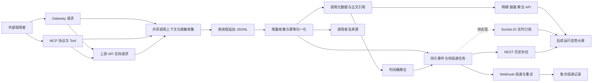

# 统一调用日志、审计与可观测性设计

> Document status: Approved design baseline; bounded endpoint contracts verified; implementation in progress
> Scope decision (2026-09-08, approved): 用户明确允许统一修改旧接口和数据库结构。新采集仅输出 schemaVersion=2，新查询不导入旧格式、不保留旧接口兼容别名；数据库维护新的初始化基线，不设计旧库升级链。实际旧数据不自动删除。
> 配套需求：[功能需求文档](../guides/runtime-observability-requirements.md)。
> 方案及建议默认值已于 2026-09-08 由用户确认，当前按开发计划实施；当前状态唯一汇总为 [completion-review](../guides/runtime-observability-completion-review.md)，实际变更、验收证据及真实剩余清单见 execution-status，未部署或处理业务库。
> 实施配套：[对外 API Endpoint](./runtime-observability-api-endpoints.md)、[开发任务计划](../guides/runtime-observability-development-task-plan.md)、[执行状态](../guides/runtime-observability-development-execution-status.md)。

## 1. 设计决策

本文保留批准的规范设计；未在“当前实现”中明确确认的目标，不构成已经实现、验证或部署的承诺。OBS-API-01~26 已在各自限定契约内 VERIFIED，27/28 policies 未实现；新 Socket.IO 协议未实现，Webhook 闭环默认关闭且未部署，AVAILABLE=0。任务包状态以完成情况复核为准，不能因整体平台验收未完成而降低 TP-11/12 的 DONE。

采用“共享采集契约 + 本地追加日志 + 增量数据库索引 + 持久事件投递”的方案。已有审计文件作为采集入口和恢复证据；数据库提供可查询调用事实、身份与聚合，事件表提供报送事实，投递表记录发送过程。

API 管理面集中提供 Gateway 和 MCP 的查询及推送服务。每条记录保留 serverType、runtimeAssetId 及进程实例标识，使上层能按两类服务器管理，无需每个 MCP 子进程另建管理 API。

首期以现有 TypeORM 数据库为基础，兼容 SQLite/PostgreSQL，不强制新增中间件。批准目标为使用已有 /monitoring Socket.IO/WebSocket 通道，并补充通用 HTTPS Webhook；当前仅后者已完成包内投递闭环，前者的新可观测性订阅仍待实施。REST 历史补拉覆盖可靠恢复；暂不另起 SSE 推送通道。

既有普通日志、管理操作审计、运行状态与调用证据职责保留，通过 ID 关联，不能把普通控制台日志解析为主要调用事实。

## 2. 现有接入点与证据边界

以下路径相对于仓库根目录，是批准设计的接入责任图，不表示每条拟变更均已完成。当前新增查询与持久化主链位于 packages/api-nova-api/src/modules/call-observability。

| 接入点 | 接入责任与设计目标 |
| --- | --- |
| packages/api-nova-api/src/modules/gateway-runtime/gateway-runtime.controller.ts | Gateway 入口，建立一次内部调用上下文，覆盖返回与拒绝分支 |
| packages/api-nova-api/src/modules/gateway-runtime/services/gateway-runtime.service.ts | 转发、策略、缓存与结果处理；分离入口与实际出站证据 |
| packages/api-nova-api/src/modules/gateway-runtime/services/gateway-access-log.service.ts | 在接入与集成包中移除重复调用日志写入/查询，收敛到单一调用事实 |
| packages/api-nova-parser/src/audit/runtime-call-audit.ts | 复用 begin/finish、正文脱敏与 JSONL，扩展阶段记录及可恢复采集 |
| packages/api-nova-parser/src/transformer/index.ts | MCP 上游请求执行接入位置；编码时确认每个实际尝试与重定向边界 |
| packages/api-nova-server/src/tools/runtime-security.ts | 可信身份与认证失败上下文 |
| packages/api-nova-server/src/transportUtils/audit.ts | MCP 协议、工具调用审计关联 |
| packages/api-nova-server/src/transportUtils/stream.ts、sse.ts | 会话、长流、终止与传输状态 |
| packages/api-nova-api/src/modules/servers/services/server-metrics.service.ts | 已有工具观测摘要；统一后由规范事实产生相应结果事件，避免双计 |
| packages/api-nova-api/src/modules/runtime-observability | 已有事件、状态与指标；补充事件游标和采集/依赖状态 |
| packages/api-nova-api/src/modules/monitoring | 沿用现有管理入口，新增明确 DTO 与路由 |
| packages/api-nova-api/src/modules/websocket/websocket.gateway.ts | 已有 runtime-overview、runtime-event、runtime-log 等实时路径；新增统一持久事件订阅 |
| packages/api-nova-api/src/modules/endpoint-testing、runtime-verification | 统一接入上游跟踪，分别标记测试/探测来源 |

当前共享审计契约已经描述 Gateway/MCP 实际正文记录、调用者观察、默认 16 MiB 上限以及写入失败放行。本设计在该基础上补齐查询与报送，不把旧文档“改造前缺口”重复列为当前缺陷。

本轮确认存在实时发送路径，但没有完成对所有通知渠道实现的穷举验证。因此，现有实时通知不能直接被认定为已经满足本文的持久投递、去重、游标和恢复契约；这些应按验收场景明确补齐。

## 3. 总体数据流



MCP 子进程持有不可变的调用上下文并写入本进程文件；管理 API 只增量读取，不在每次查询时扫描全部 JSONL。STDIO 只输出协议数据，采集与控制信息走文件、管理器或现有受控进程通道。

持久化调用状态变更、调用者关联、规范事件和收集检查点在同一数据库事务中提交。当前由唯一 CallObservabilityStore 在事实事务中写入聚合重算标记，再由其 recomputePendingBuckets 重算。CallObservabilityOutboxService 消费规范事件生成 delivery，CallObservabilityDeliveryWorker 负责网络发送；不另建重复本地聚合、dispatcher 或 Webhook 内核。首次写入正文对象发生在事务之前，事务失败留下的孤立对象由清理任务回收。

## 4. 调用模型与关联规则

### 4.1 调用类型

| spanKind | 边界 | 主要计数 |
| --- | --- | --- |
| gateway_request | 一次外部 Gateway HTTP 请求，含缓存、未匹配与拒绝 | businessRequests、httpIngressRequests |
| mcp_protocol | 一次 MCP 协议请求或 HTTP 连接操作，含认证前拒绝 | protocolRequests；HTTP 传输时计 httpIngressRequests |
| mcp_tool | 一次已识别 tools/call，包括工具参数验证失败 | businessRequests、toolCalls |
| upstream_api | 一次实际出站 HTTP 请求，包括重试、重定向每跳 | upstreamRequests |
 
MCP HTTP envelope 与工具是不同边界：先有 protocol，再有 tool，再有 upstream；STDIO 同样可建立协议父节点，但不产生 HTTP 流量。一次 SSE 长连接不是它传输的每个工具调用。批量协议请求若当前传输支持，则每个逻辑操作独立建子节点；不在本次改造中新增协议支持。

Gateway 缓存命中没有 upstream 节点。上游测试/探测可成为 origin=test/probe 的根节点，不创建虚构外部访问。后台任务可使用 origin=internal，默认业务看板只取 external。

### 4.2 关联标识

- invocationId：在调用开始时生成，单次调用内不变；作为数据库唯一调用标识。
- traceId、parentInvocationId：串联一条因果链；异步上下文显式传播，不能仅按相邻时间猜测。
- rootInvocationId：索引根节点；父节点晚到允许暂时缺失。
- requestId：内部请求关联 ID；clientRequestId、clientCorrelationId 单独保存并限长。
- protocolRequestId、sessionIdHash：协议内关联；不得用作认证身份或全局唯一主键。
- upstreamOperationId、attemptIndex、redirectHopIndex：区分逻辑依赖、重试轮次和每次网络跳转。
- sourceInstanceId、processInstanceId、sourceSequence、sourceEventId：识别生产进程及原始记录，用于幂等和缺口检查。
- recordVersion、schemaVersion：调用投影修订版本与采集格式版本。

不直接信任客户端 traceparent 或自报 ID 作为内部主键。需要保留时记为外部关联字段；上游凭证仍由现有实例配置注入，不通过可观测性改造转发入站凭证。

runtimeAssetId 是两类服务器的统一业务身份。serverId 可保留 MCP 的历史服务标识；Gateway 不需要伪造 MCP serverId。调用保存 runtimeAssetEndpointBindingId、endpointDefinitionId、sourceServiceAssetId、sourceServiceInstanceId、operationId、toolName 和发布/路由快照。

独立 Server 缺少受管资产 ID 时保留实际 operationId/method/path，并标识 unmanaged；运行实例注册不能根据外部提交的字符串直接绑定到受管资产。

### 4.3 调用状态与错误

生命周期展示概念为 started、running、completed；采集契约 phase 使用 started、progress、finished，不混作同一枚举。outcome 为 success、error、rejected、timeout、cancelled、incomplete、unknown。HTTP status、protocolErrorCode、toolIsError、errorCategory 和 failureStage 分别保存，不能互相替代。

outcome 是本调用边界的结果：工具成功不抹掉失败的上游尝试；上游 HTTP 成功不等于工具成功；客户端响应中断也可能发生在上游已经成功之后。业务 JSON 中的“错误码”只有配置了 API 结果判定规则时才参与业务失败分类，不能任意猜测。

begin 阶段写 started；finish 写真实终态。长流可按不短于 15 秒的间隔写进度与观察字节，事件限频。进程失联且无终态时，收集器生成 outcome=unknown、completionSource=reconciled 的不完整投影，不伪造 timeout 或成功。

真实终态晚到时覆盖推断投影、增加 recordVersion，并生成 invocation.reconciled；聚合按修订撤回旧贡献再计入新贡献。已经推送的历史事件保留，当前以主体版本及更正事件表达修订，不能把设计中的 replacesEventId 当作所有事件已输出的字段。需要区分真实中断 incomplete 与缺少证据 unknown。

## 5. 存储模型

逻辑表名为设计命名；实现时遵循现有实体与空库初始化基线，不增加历史升级迁移。

| 表/对象 | 核心内容与约束 |
| --- | --- |
| runtime_invocations | 调用标识、类型、身份、资产快照、时间、结果、字节、正文引用、recordVersion；invocationId 唯一 |
| runtime_payload_objects | 请求/响应分侧内容、状态、策略版本、摘要、大小、对象定位和过期时间 |
| runtime_callers | 稳定可信主体、显示备注、first/lastSeen、状态；沿用已有 callerId |
| runtime_caller_credentials | callerId 与凭证记录/subject 的关系，不含原始 Key、JWT 或授权头 |
| runtime_access_sources | 匿名/认证失败来源、可信 IP 观察与来源类别；限制高基数 |
| runtime_caller_observations | 调用者、来源、服务器和协议关系；first/lastSeen、活动时间桶 |
| runtime_ingest_checkpoints | 文件身份、已提交字节位置、进程序号和最近成功/失败；按完整记录提交 |
| runtime_ingest_receipts | 当前 v2 的 sourceInstanceId/sourceEventId 唯一身份；防重与冲突隔离 |
| runtime_metric_buckets | 可合并计数、字节和固定耗时直方图；bucketVersion 与水位 |
| runtime_caller_buckets | callerId/服务器/时间活动及计数；支持去重活跃人数与调用者历史 |
| runtime_observability_events | 复用现有事件，扩展规范信封、持久 sequence、主体/资源及调用关联 |
| runtime_event_subscriptions | 状态 enabled/paused/deleted、destination 对象、过滤、权限范围、修订、生效 sequence、密钥引用 |
| runtime_subscription_revisions | 配置快照及 [effectiveFromSequence, effectiveUntilSequence) 有效区间、revoked |
| runtime_event_deliveries | subscriptionId/eventId 唯一，状态、租约、下次重试、次数、配置修订 |
| runtime_event_delivery_attempts | deliveryId/attemptNo 唯一，每次发送及响应摘要 |
| runtime_pipeline_state | 收集/聚合/投递水位、积压、失败计数、容量与最新自检时间 |

调用详情索引至少包括 (startedAt, invocationId)、(runtimeAssetId, startedAt)、(callerId, startedAt)、(endpointDefinitionId, startedAt)、(spanKind, outcome, startedAt)、traceId、parentInvocationId 和 upstreamOperationId。按实际查询选择组合索引，避免给大正文或不受控 URL 建全文索引。

正文使用受控文件对象目录，数据库只存定位和脱敏元数据；与元数据分开过期。以 invocationId/side/version 分配对象，不对不同调用的敏感正文做跨主体去重。先写临时文件再原子改名，路径由服务生成；不能把数据库中的任意路径当作可读取文件。

SQLite 首期使用单收集/聚合写入者、短批次事务与现有方言工具；PostgreSQL 可扩展多 worker 租约。事件顺序和幂等依赖唯一约束及事务，不依赖某一种数据库的 JSON 查询扩展。

## 6. 采集、归一化与故障恢复

### 6.1 全新开发版本契约

采集层固定 schemaVersion=2，显式记录 spanKind、phase、recordVersion、eventId、processId/sourceSequence、内部因果 ID 和字节计量方式。仅接受当前格式，不推断旧 Gateway DB 与 JSONL 之间的对应关系，也不从上游日志补造外部入口。

begin、progress、finish 是同一 invocationId 的不同版本；每次写入使用独立 eventId。收集器消费专用 v2 文件，未知 schema 隔离并报告格式错误。无历史自动导入，不维护 legacy 查询路径。

共享字段、规范化与统计参考实现收敛在 parser/audit/runtime-observability-contract.ts；API 负责存储、查询和报送，parser 不依赖 NestJS 或数据库。实际核查与验证见 [契约接入映射](./runtime-observability-contract-mapping.md)。

### 6.2 增量导入

每个进程只追加自身文件，使用启动 UUID 而不是可复用 PID 作为稳定身份。管理进程以有限批次读取完整记录并提交收集检查点。文件末尾不完整行等待后续数据，关闭后仍不完整则隔离并记录缺口。

v2 正文采用有界采集/暂存，收集按正文上限和 Base64 膨胀设置明确行上限。超出支持上限的记录隔离，不尝试无界读入。

同一次导入事务写入去重 receipt、调用新版本、身份关系、终态/更正事件和检查点；事务失败从旧位置重试。若相同 ID 出现不同已完成内容，隔离为冲突，不覆盖证据。

重命名、轮转和文件截断分别识别。检查点不能只使用路径，旧文件在已确认导入且过了恢复保留期后才删除。重复扫描、重复进程通知、数据库重启不能造成调用或聚合重复。

### 6.3 可靠性与降级

正常关闭排空已提交的采集队列；进程强杀前仍在内存中的数据不保证留存。可选更强刷盘策略需要单独性能评估，首期不宣称每次业务返回前已 fsync。

采集内存预算建议 128 MiB、只排队有界元数据/正文对象引用。大正文使用背压或受限暂存，不能同时给每个并发请求预留 16 MiB。预算不足时优先保留元数据，正文标记 omitted/capture_budget；若连元数据也无法保留，则增加 droppedRecords/knownGaps 并通过独立 stderr/运行健康路径报告。

数据库不可用时使用本地暂存；恢复后从检查点继续。暂存满、权限失效或过期清理时，不能静默删除未导入数据。确需容量降级时生成带来源/时间范围的缺口记录，并在恢复后补报。无法知道丢失数量时返回 unknown，不能编造精确计数。

设计目标要求采集、聚合与报送各有心跳；当前持久 worker 执行记录不等于持续心跳或当前在线证明。整个持久层不可用时事件推送本身也可能不可用，运维必须能够从独立健康探针或进程 stderr 得知异常。

## 7. 身份与 IP 观察

已验证 JWT 沿用现有 issuer + NUL + sub 的稳定 callerId 规则，不重新编码全部历史身份。API Key 优先使用受信任 subject，credentialId 为可轮换的关联标识。旧 Gateway 凭证级主体需显式映射才能跨 Key 归并。

记录 authState、identitySource、callerId、credentialId、sourceId、peerIp、clientIp、ipSource、proxyTrusted。批准目标为共享可信代理规则，从直接连接端逐跳验证，不能只读取客户端提供的第一个 X-Forwarded-For 值。当前 Gateway 接入仅信任直接 socket peer，不能据此声称完整逐跳代理解析已闭环；显式主体映射同样不能由备注/标签 API 代替。

匿名观察按授权资源范围与来源特征生成带版本的 HMAC 标识，可按天聚合；密钥轮换通过 keyVersion 区分，不能保证匿名主体跨天或跨代理地址稳定。不把匿名来源数展示为人数。

认证成功后先记录可信 caller，再决定该工具/路由权限。认证失败仅进入来源观察，避免把伪造 JWT sub 或 API Key 当成真实主体。来源实体按作用域限制高基数，超限汇入 unclassified/overflow 桶并返回降级数量。

调用者计数通过规范入库事实维护。不导入旧 external-callers 文件。新调用者清单从 v2 入库事实生成，historyCompleteSince 仅在具备可信覆盖证据时表示有效起点；未知必须返回 null，不将最早观察时间自动当作全历史完整证明。

## 8. 正文、字节与留存

### 8.1 正文状态

每一侧至少提供 state、reason、contentType、encoding、observedBytes、capturedBytes、storedBytes、redacted、redactionPolicyVersion、capturedDigest 和 digestScope。

state 为 captured、omitted、incomplete、expired、unavailable；正常空正文为 captured 且 observedBytes=0。reason 区分 not_read、size_limit、invalid_json、unsupported_multipart、stream_interrupted、policy、capture_budget、storage_failure 等当前格式原因；不增加 legacy 导入或兼容查询。

capturedDigest 沿用既有原始观察字节摘要时须标识 digestScope=observed_raw；额外的 storedDigest 用于验证脱敏后保存内容。部分流摘要标记 partial。默认不在推送或聚合中暴露摘要，避免低熵敏感值被枚举。

既有正文策略继续生效；不能因日志上限降低而改变业务 HTTP 接收限制。MCP 已有入站大小限制属于独立传输策略，日志遗漏不能额外改变正常业务响应。

### 8.2 流量口径

- HTTP 调用在各自应用边界测量请求/响应 body 字节，在脱敏、截断和 Base64 前计量。
- byteMeasurement=observed_body、serialized_payload 或 unavailable；measurementStage 说明是在内容解码前、后或未知。
- MCP 工具参数/结果的 UTF-8 序列化字节为逻辑 Payload 大小，不等同于它的 HTTP/SSE 网络流量。
- httpIngressBytes 只汇总 Gateway 入口和 MCP HTTP 协议边界；upstreamBytes 只汇总实际 HTTP 出站，二者分别显示。
- 缺失或中断字节返回 null 或已知下界，并提供 measuredRecords、unmeasuredRecords、partialRecords；不能拿采集上限充当传输总量。
- 默认不计 HTTP Header、TCP、TLS 开销；计量方式变化需提升 schema/measurementVersion。

### 8.3 生命周期和容量

本节为批准的治理设计，TP-14 未完成，不能把全部清理调度、配额和策略接口写成当前保证。元数据/正文/事件/投递/聚合分别设 TTL。建议值见需求；正文先到期后仍可查询调用详情及 expired 状态。原始 JSONL 含正文，不能因为称为“恢复日志”而无限保留：已导入默认 48 小时清理，未导入最长受正文 TTL 和磁盘配额约束，达到约束时显式报缺口。

receipt 去重记录至少保留到所有可能被重新导入的源文件退出保留期，避免明细删除后旧文件再次导入。已退役文件身份保留轻量墓碑，阻止把过期数据复活；本期不提供旧格式历史回填；当前 v2 数据集初始化也不得复活已过期事实。

容量按实际负载估算，不能用默认天数承诺固定磁盘足够。近似原始正文容量为 requestsPerSecond × averageBodyBytes × 86400 × retentionDays，另加 Base64/结构化开销、元数据、索引、暂存和备份。100 请求/秒、请求响应合计 8 KiB，原始正文约 65.9 GiB/天，7 天约 461 GiB，必须通过容量规划或显式采集策略匹配部署。

清理操作保留运行审计和删除水位。备份与归档的正文 TTL 由部署策略覆盖；不能声称删除在线文件等于已经删除所有备份。

## 9. 统计模型与口径

### 9.1 指标定义

| 指标 | 定义 |
| --- | --- |
| businessRequests | gateway_request + mcp_tool；不加 mcp_protocol 或 upstream_api |
| httpIngressRequests | HTTP Gateway + MCP HTTP 协议入口；STDIO 排除 |
| upstreamRequests | 实际 upstream_api 节点数，含每次重定向跳转 |
| retryAttempts | 去重后的 (upstreamOperationId, attemptIndex > 1) 数；不因重定向重复增加 |
| totalStarted | 按 startedAt 落桶的调用数，含尚未完成 |
| knownCompleted | success + error + rejected + timeout + cancelled + incomplete |
| failures | error + timeout + incomplete；unknown 单独列示 |
| successRate | success / knownCompleted；无分母时 null |
| errorRate | failures / (success + failures)；拒绝/取消另报，不混入该技术失败率 |
| uniqueCallers | 范围内不同可信 callerId 数；跨桶、跨服务器做集合去重 |
| anonymousSources | 范围内观察来源数量，与 uniqueCallers 分列 |
| requestBytes/responseBytes | 所选同一种边界/计量类型的已知观察量，附缺失与下界信息 |
| inFlight | 最近有效进程状态下尚未完成调用数；失联进程另列 unknownInFlight |
| p50/p95/p99 | 固定延迟直方图估计，返回 algorithm 和误差区间，不平均已有 p95 |

日志和统计默认 timeBasis=startedAt；需要完成吞吐时显式使用 completedAt，响应回显。过滤一个 start 时间区间可能包含仍在运行的请求，不能拿 totalStarted 直接作为完成成功率的分母。

同一调用的终态或更正更新它所属的时间桶。默认 origin=external。无流量返回零计数、null 比率，同时返回采集状态以区分“观察到零”和“未观察到数据”。

缓存仅对 gateway_request 统计：cacheHits 为已观察 true，cacheMisses 为已观察 false，命中率为 cacheHits / (cacheHits + cacheMisses)，分母为零时 null。cacheEligibleRecords、cacheObservedRecords、cacheUnknownRecords 和 cacheCoveragePartial 公开覆盖。非 Gateway span 不入分母；未知不当 miss。parser 保持 CanonicalInvocation.cacheHit 必需 boolean 契约，以 missingFields 中的 cacheHit 标记保留未知并保留其他缺失标记；统计在真实 normalize 后识别三态。历史记录若已丢失缺失标记，不能推断恢复原值。

当前 dependencies 沿已授权的同 trace/runtimeAssetId/origin parent 链寻找最近 gateway_request 或 mcp_tool，不能用 protocol root 代替业务访问。同一 Tool 多次失败上游只计一个受影响业务调用；同一 protocol 下多个 Tool 分别计数。缺失/隐藏父链只标不完整，不穿越授权边界补归因；输出实际观察到的依赖，不冒充全部配置拓扑。

### 9.2 聚合与保留

明细期内支持精确条件过滤与去重。分钟聚合保存计数、和、最大值、字节与固定直方图；调用者桶保存实际 callerId/服务器活动，跨时间桶去重时取并集或查询 DISTINCT，不能相加。

建议直方图边界为 1、5、10、25、50、100、250、500、1000、2500、5000、10000、30000、60000 ms 及溢出桶。分位数返回所在区间及估计上界；落入溢出桶时返回下界，不伪造有限精确值。

长期聚合保留“时间+服务器+API/Tool”和“时间+调用者+服务器”两类必要粒度，避免生成全部维度笛卡尔积。超过明细保留期的“调用者+API+上游实例”任意交叉查询不保证支持，设计目标要求明确拒绝不支持的组合并由 capabilities 说明；422 UNSUPPORTED_HISTORICAL_DIMENSION 属于设计预期，不是当前所有统计接口已实现的错误码。

当前持久聚合由唯一 Store 维护 runtime_metric_buckets 与 runtime_caller_buckets，待重算协议是 metrics.recompute.state=pending。事实版本变化标记相关桶，重算失败保留 pending 与诊断，成功更新桶版本和规范事件。pipeline 按此协议读取，包括尚待重算的已过期标记；不访问已移除的 dirtyVersion、recomputeState 或 dispatchcheckpoint，也不建立第二套租约聚合器。消费者按桶版本替换或重查，不按事件次数叠加。

大屏查询返回 dataWatermark、aggregationLagMs、historyCompleteSince、isPartial 和 gapRanges。当前格式的缺失字节、数据集覆盖缺口等都参与完整性计算；没有证据的水位/延迟返回未知，不用初始化时间补全。详细 API 可返回 observed/estimated 字节分组，不把不同测量阶段静默合并。

## 10. 对外 API 契约

下表保留批准路由目标。OBS-API-01~26 已完成限定契约验证；/policies 两路由仍为设计目标。实际参数、字段与错误以配套 Endpoint 契约为准，不将路由存在等同于全部 FR 已验收。完整公共前缀为 /api/v1/monitoring，不发布另一套同义基地址。

新接口公共路径为 /api/v1/monitoring/observability。沿用 management JWT 与明确权限，服务身份使用同一受管认证通道。业务 Gateway/MCP 凭证不能访问这些管理数据。

### 10.1 路由

| 方法与相对路径 | 用途 | 特殊参数/说明 |
| --- | --- | --- |
| GET /capabilities | schema、支持维度/组合、保留窗口、计量口径与限制 | 返回按权限裁剪后的能力 |
| GET /overview | 总览与初始化快照 | invocationSnapshotSeq 仅调用事实；混合状态无全局水位 |
| GET /invocations | 元数据列表 | 时间、callerId/sourceId、serverType/runtimeAssetId、spanKind、API/Tool、结果等 |
| GET /invocations/:id | 调用详情 | 含正文状态与链接、关联事件 ID |
| GET /invocations/:id/payloads/:side | 请求或响应正文 | side=request/response；单独正文权限 |
| GET /traces/:traceId | 父子调用与时间线 | 标记缺失/隐藏节点、调用链完整度 |
| GET /callers | 可信调用者清单与范围统计 | 搜索、认证类型、服务器、时间 |
| GET /callers/:id | 调用者详情 | first/lastSeen、凭证引用和访问摘要 |
| PATCH /callers/:id | 备注、标签 | 不修改历史认证事实；主体映射另走受控配置 |
| GET /sources | 匿名/失败来源与关联 IP 观察 | IP 字段另需权限，支持认证状态过滤 |
| GET /statistics/summary | 当前过滤范围汇总 | 必须声明 scope 与 timeBasis |
| GET /statistics/time-series | 时间桶序列 | interval、fill、scope |
| GET /statistics/groups | 分组排行 | groupBy、orderBy、top，最多两个维度 |
| GET /dependencies | 上游依赖与影响汇总 | endpoint/上游实例、请求与失败、关联外部调用数 |
| GET /servers/status | 服务器、依赖、采集状态 | 当前为授权资产与持久状态；真实心跳/健康未知 |
| GET /events | 持久事件历史/补拉 | after、until、类型/严重级别/服务器过滤 |
| POST /subscriptions | 创建 Webhook 订阅 | 目的地址、过滤、密钥引用、生效范围 |
| GET /subscriptions | 查询订阅 | 配置脱敏 |
| GET /subscriptions/:id | 订阅详情与健康 | 不返回签名秘密 |
| PATCH /subscriptions/:id | 更新过滤、地址、启停 | 乐观版本控制，新事件生效 |
| DELETE /subscriptions/:id | 软删除并停止新投递 | 保留历史 |
| POST /subscriptions/:id/test | 发送一条明确 test 事件 | 写投递记录，不计外部业务访问 |
| GET /deliveries | 逻辑投递列表 | subscriptionId、eventId、状态和时间 |
| GET /deliveries/:id | 投递及所有尝试 | 受限响应摘要 |
| POST /deliveries/:id/retry | 人工重投 | 同一 eventId，新尝试，支持 Idempotency-Key |
| GET /pipeline/status | 采集/聚合/报送健康 | 当前为真实持久积压/运行记录；未知容量/健康不补值 |
| GET /policies | 有效采集、保留和容量策略 | 按作用域返回配置版本 |
| PATCH /policies/:id | 修改策略 | 明确权限、审计、配置修订 |

首次订阅默认从创建时的已提交事件水位之后开始；不自动把历史正文或全部调用推向新地址。需要历史回放时使用受控事件查询，批量历史重投不在首期；单条已存在投递可 retry。

按新 Endpoint 文档统一查询入口。/management/gateway-access-logs、/management/external-callers 等重复调用日志路径在集成包中收敛，不保留兼容别名；更新现有调用方，维持必要的管理生命周期功能。

### 10.2 查询规范与响应

以下为设计参数集合，不代表每条路由都接受全部字段；各路由执行自己的白名单。过滤参数：from、to、timeBasis、origin、serverType、runtimeAssetId、callerId、sourceId、endpointDefinitionId、toolName、sourceServiceInstanceId、spanKind、outcome、errorCategory、traceId、requestId、cursor、limit。不适用的参数返回 400，不静默忽略。

列表 limit 默认 50、最大 200，按 (startedAt DESC, invocationId DESC) 稳定翻页。查询游标包含过滤摘要、授权范围、快照水位与最后位置，由服务签名；跨过滤或权限范围复用返回 400/403。

统计默认最近 1 小时，最多 1440 个桶，top 最大 100。长时间范围须选择相应粗粒度；服务不默默截断时间区间。时间边界为 UTC [from,to)，固定时长桶按 UTC 对齐；展示时区由前端转换。自然日时区聚合如后续引入需新增显式契约，不能用 UTC 日桶伪装当地日桶。

scope 必选 business、http_ingress、tool、protocol 或 upstream，防止默认把所有节点加总。origin 默认 external。groups 最多两个维度，超出可用历史粒度返回可解释错误。正文接口受大小、读取频率和资源权限限制。

响应示意：
```json
{
  "status": "success",
  "data": {
    "items": [
      {
        "invocationId": "inv-1",
        "traceId": "trace-1",
        "spanKind": "mcp_tool",
        "serverType": "mcp",
        "runtimeAssetId": "runtime-1",
        "callerId": "caller-1",
        "toolName": "get_order",
        "outcome": "error",
        "httpStatus": 200,
        "toolIsError": true,
        "durationMs": 320,
        "payloadState": { "request": "captured", "response": "captured" }
      }
    ],
    "nextCursor": null
  },
  "meta": {
    "schemaVersion": "1.0",
    "snapshotSeq": "1842",
    "dataWatermark": "1839",
    "timeBasis": "startedAt",
    "origin": "external",
    "isPartial": false,
    "historyCompleteSince": null
  }
}
```

isPartial 表示覆盖缺口/不完整，不等于水位存在几秒正常延迟；另返回 lagMs。计数/累计字节超出安全整数范围时使用十进制字符串，event sequence 始终用字符串。示例为说明性数据，不是当前所有路由的统一字段保证；未知覆盖返回 null/明确缺口，不能复制示例水位或完整性值作为默认值。

错误包括 400 INVALID_QUERY、401、403、404、410 PAYLOAD_EXPIRED/EVENT_CURSOR_EXPIRED、413 QUERY_TOO_LARGE；设计目标另含 422 UNSUPPORTED_HISTORICAL_DIMENSION（当前未统一实现）、429 和 503 OBSERVABILITY_UNAVAILABLE。已知但未采集正文返回 200 的 state/reason；整个调用不可见时不通过错误内容泄露其存在。

## 11. 持久事件与主动推送

### 11.1 事件信封与类型

事件结构复用 runtime_observability_events 的 family、severity、状态、资源与时间概念，增加下述对外稳定信封，不直接输出数据库实体：

```json
{
  "schemaVersion": "1.0",
  "eventId": "event-1",
  "sequence": "1843",
  "eventType": "invocation.completed",
  "occurredAt": "2026-09-08T10:00:01.000Z",
  "recordedAt": "2026-09-08T10:00:01.150Z",
  "server": { "type": "gateway", "runtimeAssetId": "runtime-2" },
  "subject": { "kind": "invocation", "id": "inv-2", "version": 2 },
  "traceId": "trace-2",
  "severity": "error",
  "data": {
    "spanKind": "gateway_request",
    "outcome": "timeout",
    "durationMs": 3000,
    "callerId": "caller-2",
    "endpointDefinitionId": "endpoint-2"
  },
  "links": { "invocation": "/api/v1/monitoring/observability/invocations/inv-2" }
}
```

当前保留的七类规范事件：invocation.completed、invocation.reconciled、caller.discovered、server.state_changed、server.snapshot、metrics.bucket_updated、pipeline.state_changed。失败通过 invocation.completed 的 outcome/severity 过滤，不再为同一次失败额外生成一个必需的 invocation.failed 计数事件。上游失败使用 spanKind=upstream_api。

started/progress 主要更新查询状态和当前指标，不默认逐条对外推送；后续可按负载开放。控制面既有事件仍保留，但不能把所有旧 runtime-event 自动认作符合上述七类规范信封。

业务事件发生时间 occurredAt 与管理面入库 recordedAt 分开。sequence 是部署内提交顺序，不代表跨进程实际发生顺序；因果分析仍依赖 trace/parent。

### 11.2 顺序、Outbox 与去重

由数据库事务内的串行序号分配器产生 sequence，保证对外可见序号按提交推进。PostgreSQL 仅用自增 ID 或调用前分配序号不能作为这个保证；实现需持有短事务计数行锁，SQLite 使用同一单写入事务。回滚不产生可见事件。

事件写入即进入 durable outbox。分发器为符合生效 sequence 和配置修订的订阅创建 delivery，并以 (subscriptionId,eventId) 唯一键去重；任务创建和分发水位同事务提交。过滤与授权作用于事件所属资源，不以客户端 room 名替代授权。

当前订阅状态为 enabled/paused/deleted，destination 使用 { type: 'webhook', url } 对象，不接受把地址字符串当作完整 destination。创建/修改输入通过 enabled 控制启停。数据库修订使用 effectiveFromSequence/effectiveUntilSequence，按 [from, until) 选路，until=null 表示无上界；公开 DTO 的起点名为 effectiveFromSeq，版本为 version。旧事件按当时配置选路，旧配置作为脱敏审计快照保留；暂停时停止派发和重试，恢复后继续已有积压，新事件是否积压固定为“暂停期间不创建”，返回 pausedGapRange。禁止在暂停恢复后悄悄补发暂停期全部事件。

修改地址或秘密时，未发送任务使用已绑定的配置修订；撤销某修订应将其待投递标为 cancelled，重新授权后可显式 retry。每次发送还检查订阅所有者当前资源权限与授权有效期。

### 11.3 Webhook 发送

POST JSON 单事件；Header 含 X-ApiNova-Event-Id、X-ApiNova-Delivery-Id、X-ApiNova-Timestamp、X-ApiNova-Signature。签名为 HMAC-SHA256(timestamp + "." + 原始发送 body)，使用专用订阅 secretRef，不复用业务 API Key。密钥支持版本轮换，绝不在读接口返回原文。

接收端验证签名和时间窗口，按 eventId 幂等处理；重复尝试使用相同 eventId 和新的发送 timestamp。deliveryId 表示逻辑投递，attemptNo 区分尝试。接收端 2xx 视为接收成功，包括 202；不能由此推断已完成后续处理。

默认总请求超时 10 秒，首次立即尝试，失败后按 5 秒、30 秒、2 分钟、10 分钟、30 分钟重试并加入抖动，共最多 6 次；最长保留活动重试 24 小时。网络错误、408、429、5xx 可重试；Retry-After 在上限内尊重，超过活动窗口进入 dead。其他 4xx 记为永久失败；3xx 不自动跟随。

worker 领取有到期时间的租约；进程中断后可重新领取。发送成功但确认事务未提交可能再次发送，这是至少一次语义。人工 retry 保留 eventId 与历史 attempts，增加 replayGeneration 并生成管理审计；事件已过期不可重投，返回 410。

目的地址默认 HTTPS，按部署出站策略与可配置允许列表约束；内网接收端需显式允许网段/域名。每次实际发送验证解析后的地址，防止 DNS 变化绕过限制，默认不跟随重定向，不访问云元数据地址。测试环境 HTTP 是显式配置，不能自动从请求参数放开。

响应正文只保留受限、脱敏的诊断摘要，建议上限 2 KiB；错误 URL 不含秘密。投递等内部遥测通信排除业务调用采集；规范 origin 只有 external/test/probe/internal，不新增 telemetry 枚举。delivery 失败改变 pipeline 健康，不向同一个失败订阅递归发送其自身每一次失败事件。

### 11.4 WebSocket 与历史恢复

当前 GET /events 保留七类事件、1000 条扫描上限、固定高水位分页和完整 complete 语义。过滤后空 items 仍可推进已扫描位置；未 complete 前保持本轮高水位，完成后才能推进下一轮。after 签名游标绑定授权范围和过滤，过期证据返回 410，错误元数据为 availableFrom、resnapshotRequired，不静默跳过缺口。

origin 为可选单值过滤；未传时不隐式限制 external，显式传入时不把未知 origin 猜作匹配。afterSequence 与 after 互斥；知道 sequence 本身不构成读取授权。

当前 overview→events 桥接由 CallObservabilityOverviewSnapshotAuthorizer 登记成功签发的调用事实快照，EVENTS_SNAPSHOT_AUTHORIZER 通过 useExisting 使用同一个 singleton。authorize(sequence, scope, filter) 仅放行已签发且当前主体/权限/资产 scope fingerprint 未变、origin/serverType/runtimeAssetId 兼容的请求；额外事件条件只能收窄。TTL 为 5 分钟，容量最多 1000 项并淘汰最早签发项；进程重启、到期或淘汰后必须重新获取 overview，不写数据库伪水位。

overview 的 invocationSnapshotSeq 及其授权/到期信息仅适用于 invocation_facts_only。混合 overview 的旧 serverStates 没有全局一致增量证明，不能把调用事实序号当作服务器状态完整快照，也不能宣称完成 Socket.IO 无缝切换。

以下仍为 OBS-TP-13 设计目标：在 /monitoring 新增 subscribe-observability、subscription-confirmed 与 observability-event，复用同一持久事件源；握手、补拉及持续发送均重新检查授权，凭证失效停止发送。先固定高水位 H，再补拉 (after,H] 并衔接实时事件；使用有界缓冲或持久重读避免竞态。慢消费者达到上限断开，按最后已处理游标恢复；已发送不等于已处理，不为每个浏览器提供持久 ACK。

统计桶按版本替换或失效重查，不按重复消息累加；后续完整状态快照需要独立可证明的版本/水位。现有 runtime-event 广播不具备上述契约，不能当作本包已实现。

### 11.5 服务器状态与心跳

批准目标为复用已有生命周期/健康模型，并增加 freshnessStatus、lastHeartbeatAt、processInstanceId、dataWatermark、activeInvocations 和 dependencyHealth。业务失败率、进程状态和采集健康分别输出。

目标为默认每 15 秒汇报一次状态快照，无业务调用也发送。45 秒无心跳先标 stale/unknown；只有受管进程明确退出或探测确认时标 offline。单次上游失败产生调用事件，按配置窗口/阈值再影响 dependencyHealth，不能直接把整台 Gateway 标离线。

当前 servers/status 依据授权资产与持久运行状态返回实际证据，overview 不补造心跳/健康/全局覆盖；server.snapshot 事件类型存在也不能证明已有定时心跳。独立管理进程心跳已实现单租约持有者的存储往返证据，不据此判断业务健康；业务实时在途、无流量心跳及独立失联判断仍需TP-10/13/14闭环。

## 12. 权限与管理审计

当前公共权限基础复用 monitoring:read、monitoring:manage，并提供细分授权：monitoring:payload:read、monitoring:source:read、monitoring:subscription:manage、monitoring:delivery:retry。细分权限与资源范围已接入公共安全原语；独立外部服务身份的完整交付不能仅由管理 JWT 等同证明。

正文读取必须同时满足 monitoring:read、monitoring:payload:read 和目标资源权限；源 IP 类似。无论现有多权限装饰器采用 ANY 还是 ALL，都必须用明确 guard/策略实现上述 AND 语义，不能依赖未验证装饰器行为。

聚合与详情执行同一授权过滤。跨资源 trace 只返回可访问节点及通用不完整标记，不泄露隐藏节点的 URL、主体、数量或错误内容。请求游标、筛选列表和 capabilities 同样按权限裁剪。

服务端推送到经授权配置的 Webhook 地址，本质上授予该接收端订阅范围内元数据读取权；创建时校验拥有者权限，每次投递再次检查。默认不允许订阅正文或原始 IP。

对正文读取、策略/映射/订阅变更、测试推送和人工 retry 写管理审计；不对每次统计刷新再制造同等规模的业务调用事件。既有管理审计如有更长保留要求，沿用更严格配置。

## 13. 新版本结构与实施分解

| 步骤 | 交付 | 关键依赖/验收 |
| --- | --- | --- |
| A | 共享 schema、上下文、边界捕获、身份/来源映射 | FR-01~04；先证明单次调用与重试不会双计 |
| B | 新实体、增量收集、新格式校验、正文对象和恢复 | FR-03/04/10；重复导入、半行、磁盘/数据库故障 |
| C | 明细、正文、trace、callers/sources、权限 | FR-05/09；跨资源保护、历史可解释 |
| D | 聚合、capabilities、状态与 pipeline API | FR-06/08；计数与字节口径、迟到更正 |
| E | 持久事件、Webhook、投递恢复、Socket.IO 补拉 | FR-07；重复、断线、游标过期、重启 |
| F | 接口收敛、文档与计划中的场景/负载验证 | AC-01~20；SQLite/PostgreSQL 与两平台 |

数据库按当前实体维护 SQLite/PostgreSQL 初始化基线，仅在隔离空库中验证。用户允许结构调整，不表示授权清空现有开发数据；需要重建实际数据库时明确列出目标及数据影响。新版本不维护旧数据升级链或自动历史回填。

集成时直接收敛旧日志 Endpoint 和内部调用方，不建立双套查询真相。关闭新采集/报送 worker 不应自动删除调用证据。代码、测试与文档按任务计划持续推进，大屏 UI、多主机远程采集和外部消息总线仍为后续阶段。

## 14. 已确认决策

以下默认边界已由用户确认：同机多进程汇集；保留完整脱敏正文及既有 16 MiB 上限；按 30 天元数据/7 天正文等建议 TTL 治理；Webhook 至少一次投递加现有 Socket.IO 补拉；业务不中断、采集损失必须显式可观测。

实施阶段需要测量的技术项包括具体采集分支覆盖、旧记录关联字段、字节测量阶段、数据库容量与性能。这些属于确认后的工程验证工作，不把尚未验证的性能或覆盖范围写成已实现保证。

## 15. 当前实现边界与协议约束

- 唯一 Store/Outbox/DeliveryWorker 主链承载调用、聚合、事件与投递；不恢复已移除的本地重复内核。
- pipeline 聚合队列读取 metrics.recompute.state=pending。分发状态 ID 为 call-observability:outbox-materializer；发送状态 ID 为 call-observability:webhook-worker。分发 watermark 是无缺口物化进度，不是接收端 ACK。
- Worker 的 lastAttemptAt/最近执行报告不证明当前已启用、持续心跳或全部历史健康。没有真实测量的 lag、容量、覆盖返回未知；全局 pipeline 读取不借由资产授权扩大权限。
- Webhook 默认关闭；启用需有效部署配置、密钥与出站约束。租约恢复、签名、六次有限重试与投递管理的包内闭环已经完成，完整系统验收不反向降低 TP-11/12 DONE。
- Outbox 创建 delivery 的 expiresAt 取事件到期与创建后 14 天的较早值；批准需求为投递记录 30 天。该留存差异须由治理任务处理，不将现状写成已满足批准 TTL。
- Socket.IO、policies、全量治理、MCP 剩余传输覆盖、旧接口收敛及跨平台/数据库/性能验证仍按任务计划推进。局部 API 验证不代表整体 AC 或部署可用。

## 16. 查询与接入的稳定约束

### 16.1 分侧正文与敏感读取审计

正文独立授权并分侧读取，expired、omitted、incomplete 与空正文不能互换。敏感读取和档案变更复用管理审计；游标和强 ETag 绑定资源与当前授权，条件请求不能绕过重新授权。幂等记录不保存秘密，也不在数据库事务中发网络请求。

### 16.3 trace 图查询实现

仅沿可访问节点展示因果链。缺失或隐藏父节点标记不完整，不输出隐藏节点数量或借 rootInvocationId 猜测业务归属。Tool 成功与上游失败是不同边界。

### 16.8 能力发现与未知状态边界

capabilities 描述实际开放的参数、历史维度和限制，不从实体存在推断能力完成。overview 仅接受 from/to/origin/serverType/runtimeAssetId，使用 startedAt；不支持的参数明确拒绝，不搭虚假空区块。

### 16.9 有界统计计算内核

当前明细快照统计有界，最多选择 5000 条调用；overview 资产/状态读取亦有上限。截取范围和未知覆盖不能输出成全历史总量。不同字节测量边界分别汇总；唯一调用者取集合，分位取固定直方图区间，缓存采用第 9 节三态分母。

### 16.10 授权汇总查询接入

统计、overview、依赖和服务器状态执行实际资产授权；未知实时在途不因查询中存在 started 记录而变成已确认在线调用数。数据集可见不等于完整历史已覆盖，持久运行记录不等于真实心跳。

### 16.11 时间序列与分组：保留明细快照实现

当前时间序列/分组的限定查询与持久桶重算是不同能力层，不能从桶存在推断所有长期交叉维度已经开放。最多 1440 个桶、top 最大 100，具体查询窗口与字段按 Endpoint 契约；保留批准的长期统计目标并将差额列入执行状态。

### 16.13 桶重算与修订协议

原 B01/B02 本地接续方案不再作为当前架构。统一使用 Store 的事实修订、metrics.recompute 标记和桶版本协议；本地 overview、缓存、依赖与 pipeline 增量已合并，不建立第二条聚合/分发真相。

## 17. 文档职责与历史归档

本文维护批准设计与明确实现边界；[完成情况复核](../guides/runtime-observability-completion-review.md)是当前状态唯一汇总，[执行状态](../guides/runtime-observability-development-execution-status.md)是证据索引和真实剩余清单。历史测试次数、逐轮故障修复和已过时的 remaining-work 不在本文持续维护。

完整旧设计及历史执行锚点见[归档设计](../archive/summaries/runtime-observability-2026-09-14/runtime-observability-design.md)。归档用于追溯，不能覆盖当前远端主链协议或批准需求。
